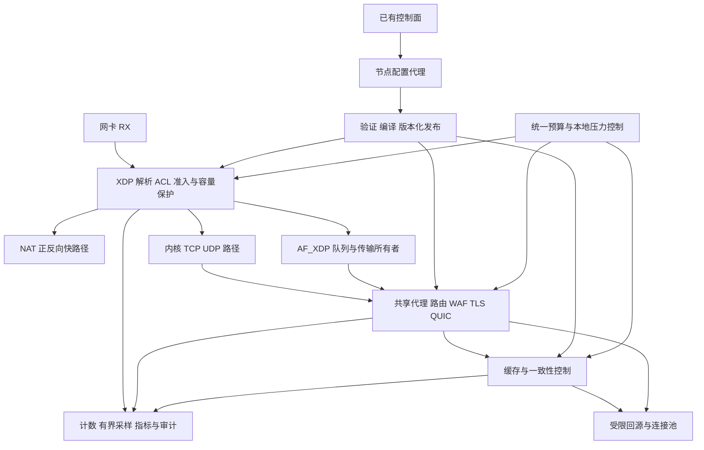

# 生产级边缘节点架构

状态：目标设计，尚未实现或通过生产认证。日期：2026-09-13。

代码审阅基线：0ca5cbd02b11f644943b25c05cdae55bd338b69b。

配套：[开发计划](../tasks/edge-node-production-plan.md) · [模型开发交接](../tasks/edge-node-development-handoff.md)。

## 1. 目标、范围与判断原则

首期目标是把现有 CloudNode Rust 做成可长期运营的边缘节点：高吞吐、低尾延迟，在攻击、依赖故障、配置变更和资源压力下保持可预测行为。覆盖 XDP/AF_XDP、TCP/UDP/QUIC、HTTP/TLS、WAF、缓存、回源、节点配置、资源治理、观测、升级与恢复。

“像 Cloudflare 一样”在本阶段对应工程属性：防护常驻、正常业务优先、按服务隔离、配置可验证、发布可回滚、故障范围受控、容量有证据。它不表示已经拥有 Cloudflare 的网络容量、全球调度或服务保证。

本阶段不建设全球 Anycast/BGP 调度、权威 DNS、全球一致控制面、计费产品平台、Workers 执行环境或跨地域缓存一致性。现有 RPC、父节点和集群接口继续兼容，新增节点状态为以后接入这些系统预留接口。链路被打满需要上游网络能力；节点必须报告该边界，不能把本机 DROP 能力等同于链路清洗能力。

本方案是基于仓库和公开规范形成的项目设计，不是对 Cloudflare 内部架构的复刻。Cloudflare 公开说明了边缘执行与异步检测的配合；本项目借鉴这种职责分离，将复杂分析移出收包关键路径。[公开防护机制](https://developers.cloudflare.com/ddos-protection/about/how-ddos-protection-works/)

### 1.1 保留的基础

| 能力 | 当前入口 | 处理原则 |
|---|---|---|
| XDP ACL、NAT、tail-call | [eBPF](../crates/cloud-node-xdp-ebpf/src/main.rs)、[共享 ABI](../crates/cloud-node-xdp-common/src/lib.rs) | 增量修正状态与资源语义，保留快路径 |
| AF_XDP 与 smoltcp | [xdp.rs](../src/xdp.rs) | 保留协议入口，按实际路径认证，消除队列和所有权问题 |
| HTTP/TCP/H3 代理 | [proxy.rs](../src/proxy.rs)、[HTTP manager](../src/http_proxy_manager.rs)、[H3 manager](../src/http3_proxy_manager.rs)、[TCP](../src/tcp_proxy.rs)、[UDP](../src/udp_proxy.rs) | 复用 Pingora、Tokio、Quinn，不重写成熟协议栈 |
| 配置快照和预编译 | [config.rs](../src/config.rs)、[config_apply.rs](../src/config_apply.rs)、[compiled.rs](../src/compiled.rs) | 补足跨组件发布协议 |
| 统一资源治理 | [memory_governor.rs](../src/memory_governor.rs)、[l4_defense.rs](../src/l4_defense.rs) | 扩展到 BPF、UMEM、队列、租户和任务 |
| 缓存与失效屏障 | [cache_hybrid.rs](../src/cache_hybrid.rs)、[purge_barrier.rs](../src/cache/purge_barrier.rs)、[process_lock.rs](../src/cache/process_lock.rs) | 保留既有屏障，先验证一致性再优化锁 |
| 内核 SYN 防御 | [kernel_syn_defense.rs](../src/kernel_syn_defense.rs) | 纳入路径能力表，不能宣称它保护了绕过内核的 AF_XDP 流量 |
| 指标、日志和运维 | [pipeline_metrics.rs](../src/pipeline_metrics.rs)、[metrics](../src/metrics.rs)、[logging.rs](../src/logging.rs)、[operations](operations.md) | 扩展为带有丢失、代次和资源边界的观测系统 |

这里“已有”只表示代码入口存在，不表示全场景正确或容量达标。

### 1.2 当前已知的优先风险

1. XDP 源地址限流默认未配置，Normal 压力下关闭；普通源地址 HashMap 满表后放行，当前未见对应回收路径。
2. TCP NAT 的 SYN 直接建立 OPEN，非关闭 TCP 状态使用两小时空闲期限，缺少半开状态的独立生命周期。
3. 部分非法解析结果直接 PASS；IPv4 长度检查、分片和不支持协议的处理没有统一分类。
4. 共享 Array 总计数器普通读改写；源 IP 限流跨 CPU 更新竞争，TCP/UDP 共用计数桶。
5. AF_XDP 容量拒绝、队列拥塞可能关闭 redirect 并回退 PASS；受保护服务不能与 XSK readiness 共用一个开关。
6. QUIC DCID 选择另一 RX 队列的 XSK 不满足普通 XSKMAP 的网卡/队列匹配约束。
7. AF_XDP 存在帧拷贝及每轮会话扫描；NAT 计费采用高基数 per-CPU map，GC 有全表遍历及线性成员判断。
8. 文档存在历史差异。旧防护计划对 Quinn 0.11 Retry 的否定结论不适用于当前文档暴露的 API；旧文档关于 XDP 默认值、存储引擎和内核版本的描述也应逐项核对。

开发者须在自己的起始 commit 重新定位这些行为。已被其他工作修复的项应提交证据并缩减任务，不能重复改写。

## 2. 必须保持的不变量

| ID | 不变量 | 对应验收 |
|---|---|---|
| I01 | 流量驱动的状态、任务、队列、字节、FD 和响应计算都有上限；满额行为有定义 | T04、T07、T12、T17 |
| I02 | SYN、UDP 首包、tuple 命中或未验证 CID 不自动获得可信身份 | T02、T03、T05 |
| I03 | 任何高基数状态创建前，先通过固定容量聚合预算；重传仍计处理成本 | T02、T04 |
| I04 | 一条已接管连接只有一个传输状态所有者；不能按单包负载随意更换内核/AF_XDP/NAT 路径 | T06、T08 |
| I05 | 请求使用可解释的配置代次；跨内核和用户态发布有准备、切换、保留、回滚协议 | T08、T14 |
| I06 | 路由、证书、缓存、上游连接池和配额不能跨越租户/服务授权边界 | T09、T10、T11 |
| I07 | purge 成功后开始的新读不会取得已失效对象；旧 fill 不得复活它 | T10、T11 |
| I08 | 控制面断连可使用仍有效的最后成功配置；遥测或缓存故障不能形成无限回源/无限重试 | T12、T13、T14 |
| I09 | 整机预算不会因 CPU、队列、接口或 worker 增加而被重复发放 | T04、T06、T17 |
| I10 | DROP、拒绝、回退、降级、遥测丢失均可观测；尝试计数不伪装成交付计数 | T06、T12、T16 |
| I11 | 原始源 IP、HTTP 转发头、PROXY header、SNI 和租户身份具有不同信任等级 | T09 |
| I12 | 部分写入、崩溃恢复、旧版本回滚不会暴露错误缓存内容或让计费静默重复 | T11、T15 |
| I13 | GC、配置构建、日志上传、压缩、图片变换不能无限占用数据面 CPU/内存 | T07、T12、T17 |
| I14 | 优化必须保持已声明的协议能力；不支持的组合在发布前拒绝或显式标记 | T01、T05、T09、T18 |
| I15 | 每个获准运行的二进制、eBPF 对象、map ABI 和配置 schema 组合都有可追踪身份 | T08、T15、T18 |

检测到攻击不等于获得无限制误伤正常流量的许可。资源饱和只触发有范围的资源动作；自动封禁需要独立的证据与策略。

### 2.1 威胁模型与可保护的边界

| 对手/故障输入 | 主要保护点 | 不可错误推导的结论 |
|---|---|---|
| 可伪造源地址的大量包 | 无状态检查、聚合预算、TCP/QUIC 回程验证 | 源地址白名单或收到 SYN 不构成身份认证 |
| 可完成握手的分布式客户端 | 服务/租户资源隔离、请求成本预算、WAF、回源预算 | 握手成功不表示后续请求永远可信 |
| 低速长连接、流/队列占用 | 分阶段 deadline、并发/字节上限、受控排空 | 低 PPS 不表示低资源消耗 |
| 共享 listener 上的恶意租户流量 | 身份确定前 listener 池，确定后租户/服务配额 | XDP 无法从共享 443 的普通 TCP 头识别 HTTP 租户 |
| 攻击性应用输入或错误配置 | 解析/编译成本上限、发布验证、隔离回退 | 配置来自控制面就可以无限分配或无限计算 |
| 故障/恶意源站与磁盘对象 | 回源 deadline、响应大小/解压预算、校验和缓存隔离 | 上游返回内容与持久化文件天然可信 |
| 组件崩溃或依赖断连 | 持久保护、所有者租约、LKG、有界重试与恢复 | fail-open 必然提升可用性 |
| 物理入口链路饱和或主机失陷 | 上游协作与节点健康报告；宿主机隔离/密钥治理 | 本节点软件可独自维持被阻断链路，或抵御已获得 root 的攻击者 |

UDP 透传特别关注反射风险：未知/未验证来源的请求与响应都要受服务预算约束；有协议验证能力时使用该能力。普通 UDP 不套用 QUIC 的专用放大规则，也不以“后端回过一个包”自动证明客户端地址有效。

## 3. 总体结构和进程边界

图表示职责，不要求一次拆成多个微服务。阶段初期保留主进程，逐步拆清模块和有界执行器。

生产目标中，XDP 保护程序的生命周期必须独立于代理 worker。使用持久化 attachment 与明确的管理所有权；EN-27 实现最小特权管理组件，可由同一二进制的独立运行模式承载。它只管理 attachment、map 发布、资源准备和 worker 租约，不处理 HTTP 请求。非特权代理 worker 不需要长期拥有全部网络管理权限。

持久化程序在 worker 死亡后继续执行基础保护，但不得永久 redirect 到失效 socket：租约超时后按服务策略拒绝新准入，或将未建立的新连接交给已验证备用承载；已有连接没有传输状态迁移机制时显式失败。代理、管理组件和机器同时失效不保证连接继续存在。

### 3.1 三条承载路径

| 路径 | 适合的工作 | 强制约束 |
|---|---|---|
| XDP NAT | 明确授权的 L4 直通转发 | 不绕过服务配额、封禁、计费和后端保护；不能声称执行了 L7 WAF |
| 内核 socket | TCP/UDP 终止，成熟协议栈承载 | 与 XDP 共享服务策略；内核 SYNPROXY/conntrack 能力按组合认证 |
| AF_XDP | 能获得实测收益的用户态传输、UDP/QUIC 和专用代理路径 | 满足队列约束、会话所有权、重启语义、字节预算与协议认证 |

保留 XDP/AF_XDP 主数据面的演进方向，不预设所有协议通过 AF_XDP 都更快。每个服务发布 PathProfile；当前选择的路径不能因为某次压测较慢而被模型擅自全局替换。内核与 AF_XDP 均参加同机、同配置的基线比较，按场景决定生产路径。

Cloudflare 的 Pingora 是可编程网络框架，本仓库已使用它；继续复用协议与代理抽象，避免从使用 Pingora 推导出本节点具有 Cloudflare 的容量。[Pingora 公开说明](https://blog.cloudflare.com/pingora-open-source/)

### 3.2 能力认证

PathProfile 记录接口/驱动/内核/架构、attach 实际模式、socket 实际 zero-copy 状态、队列数、MTU、协议、NAT/SNAT、故障策略及证据编号。

延续项目自动配置方向：接口、监听端口和资源基础量从实际配置与机器探测生成；运营面主要选择防护/路径 profile 和服务例外。不要要求每个节点手填几十个 token bucket 参数。自动配置仍须通过候选发布验证，不能把未知硬件猜成已认证能力；status/doctor 输出推导来源、实际生效值与限制。

禁止只按内核版本猜测 zero-copy；检查运行结果和 socket options。generic/SKB、native copy、native zero-copy 分开报告，veth 结果不能替代物理/virtio 网卡结果。普通 XSKMAP 不能将某 RX 队列的包直接转给另一队列绑定的 XSK。[AF_XDP 内核文档](https://docs.kernel.org/networking/af_xdp.html)

认证分级：FUNCTIONAL 表示协议通过；CAPACITY 表示容量与混合压力通过；PRODUCTION 表示故障、恢复、升级与长期运行通过。未认证的能力不伪装成已完成，但不能静默删除已有配置。

## 4. XDP 防护和状态架构

### 4.1 服务识别先于状态信任

服务查找使用安全域/接口、目标 VIP、地址族、协议、端口，支持明确的通配优先级。不能仅用端口识别租户；共享 HTTPS/QUIC 端口在 SNI/Host 可用前属于 listener 资源池，不能假称已按租户限流。

先识别客户端入站、NAT 后端回包、节点主动连接回包及必要控制流量。ACL 的放行表示继续处理，不隐式结束资源防护。可信内部代理必须配置明确的 peer 范围及隔离条件，不能把所有 RFC1918/private 地址视为可信代理。

observe 仅记录策略本会执行的动作；protect/proxy 执行对应防护。系统自身硬资源上限不受观察模式关闭，必须作为不同原因报告。

### 4.2 执行顺序

    包边界和有限协议解析
      → 服务/方向/策略分类
      → 完整性、分片与控制报文策略
      → ACL
      → 状态查询（含期限、所有者代次）
          已验证：已验证资源池 → 目标队列/后端预算 → 执行
          未验证：合法新尝试/合法验证报文/非法报文分类
               → 服务与接口固定容量预算
               → 源地址/前缀公平性
               → 目标资源与并发状态准入
               → 挑战或有界临时状态
               → NAT / XSK / 受控内核路径

新流预算必须先于源地址新桶、CT、SNAT、QUIC pending、用户态 session 的创建。最终 redirect/响应路径另有每包预算；同一个预算令牌不能被不同阶段重复扣除。预留失败、插入失败、取消均释放未提交资源。内核在返回 REDIRECT 后发生的交付失败不能同步回滚，使用短期限临时状态、交付指标和所有者反馈回收。

### 4.3 解析与特殊报文

- 验证 IPv4 IHL/total length、IPv6 payload/扩展头界限、TCP data offset、UDP length 与包尾关系；限制 VLAN/扩展头深度。若无法完整读取多缓冲包，按能力策略处理，不能基于不完整头创建可信状态。
- MALFORMED、UNSUPPORTED、FRAGMENTED、CONTROL、SUPPORTED 分开计数与动作；不再用一个通用 Err→PASS 表达所有情况。
- 实际分片按服务 VIP/安全域整体拒绝或交给有界重组路径；首片不能独自建普通 L4 状态。IPv6 atomic fragment 单独覆盖。
- 保留 PMTU、必要 ICMPv6 与邻居发现；验证相应语义并设置独立控制报文预算。非首片端口不可知，因此分片策略不能只绑定端口。[ICMPv6 过滤指导](https://www.rfc-editor.org/rfc/rfc4890.html)
- TCP flags 过滤覆盖高置信异常，保留 ECN、重传及声明支持的 TCP options/TFO。非法包不得用于刷新、晋级或关闭可信状态。
- 校验和验证成本单独测量。至少在创建高信任状态或生成挑战响应前验证所需校验和；不能假定网卡已替所有 XDP 包完成校验。

### 4.4 FlowRecord 合同

以下是逻辑字段，不是可直接复制的最终 C/Rust ABI；EN-01/09 固定大小、对齐、端序和版本后才能实现。

| 对象 | 必需信息 |
|---|---|
| FlowKey | security_domain、family、protocol、client tuple、service tuple；租户未知时使用 listener/service 身份 |
| FlowRecord | service_id、state、owner_kind、owner_epoch、flow_incarnation、created_ns、absolute_deadline_ns、validated_idle_deadline、policy_generation、验证级别 |
| FlowEvent | key、incarnation、owner_epoch、事件序号、验证/关闭/拒绝类型、发生时间；旧事件不得覆盖新连接 |
| PathBinding | KERNEL / AFXDP / NAT、必要的队列或后端绑定；不把 RX CPU 放进连接身份 |

临时状态与已验证状态分池，避免随机新流通过共享 LRU 驱逐正常连接。已验证权威表满时拒绝新晋级并保留现有连接，不把 map miss 当成无条件 PASS。LRU 只用于允许丢失的提示/临时缓存，不能单独承担连接存活事实。

普通 HashMap 的 value 可被多个 CPU 并发访问；采用单一所有者、原子字段或受支持的同步方案，明确更新顺序。每 CPU map 适合计数/预算片，不默认适合所有连接状态。LRU 自动驱逐与 per-CPU 存储的性质见[内核 map 文档](https://docs.kernel.org/bpf/map_hash.html)。

    ABSENT → PENDING → VALIDATED → CLOSING → EXPIRED
                 └──────────────→ EXPIRED

PENDING 使用绝对期限，重复 SYN/ACK 不延长最大存活时间。VALIDATED 仅由经过核实的传输所有者或验证机制晋级。CLOSING 不能因任意伪造 FIN/RST 被立即删除。XDP 查表即验证期限；GC 只回收空间。时间戳合并写入需要计入期限误差，计费计数不得随之采样丢失。

内核 TCP 未建立可验证的状态桥接前，禁止对其存量流实施“新代理 CT miss 且非 SYN 就丢”。使用已有权威状态、cookie 路径或受限的兼容承载；热启用只能对已同步或新接管连接执行严格规则。同步空窗中的报文走有界 PENDING 策略，不能简单丢弃整个握手后的首批数据。

### 4.5 预算与公平性

维护不同预算：未验证包 PPS、新状态/s、半开并发、服务 PPS/BPS、已验证流保留容量、每 XSK PPS/BPS、NAT/backend PPS/BPS、挑战响应 PPS/BPS。

CPU/队列配额之和不得超过整机上限；独立接口若共享同一资源，也共享相应上限。首版采用固定分配与明确总量，后续可采用批量额度租赁，并给出最大超发公式、租约过期和 CPU online/offline 行为。避免每包争用单个全局锁。

    aggregate_rate = sum(shard_rate)
    aggregate_burst = sum(shard_burst)
    pending_capacity >= admitted_rate × max_pending_lifetime + admitted_burst

公式用于验证一致性，不允许由配置速率推导出无限内存需求。若容量不足，应降低准入而不是扩大表到超出节点预算。基线保护在 Normal 下也存在；压力反馈只调整弹性额度，不能把整数除到 0 后反而解释为关闭。

源 IP/IPv6 前缀只提供公平性和风险信号；NAT 出口和隐私地址轮换需要独立测试。源桶耗尽时回到既有聚合上限，不关闭防护。窗口和 PPS 单位必须正确换算，UDP 与 TCP 预算分开。

### 4.6 强验证

TCP 最终目标是在未验证 SYN 上不分配昂贵连接资源。先完成有界状态准入，再通过 EN-13 验证 kernel、NAT 和 AF_XDP 路径的 cookie/SYNPROXY 接口，EN-14 实现获选组合。Linux 有 XDP raw SYN cookie 生成/验证示例，但它不自动建立 smoltcp 或后端传输状态。[内核示例](https://github.com/torvalds/linux/blob/master/tools/testing/selftests/bpf/progs/xdp_synproxy_kern.c)

必须处理 ISN、窗口缩放、MSS、时间戳、ECN、重传、第三 ACK 携带数据、关闭，以及与已有 nft SYNPROXY 的关系。不能叠加两套互不知情的握手代理。能力未完成的路径只能声明“有界准入”，不能通过“无状态强验证”认证。

QUIC 终止路径优先使用 Quinn 现成接口。当前 0.11.11 文档列出 Incoming::retry、may_retry、remote_address_validated；实现必须核对锁定源码，在 accept 前按策略处理，并限制 Retry 响应速率。[Quinn Incoming](https://docs.rs/quinn/latest/quinn/struct.Incoming.html)

QUIC passthrough 不拥有后端密钥和协议状态，不擅自插入自定义 Retry。它使用有界 Initial/CRYPTO 解析、路由和会话预算，并与后端验证能力明确分工。CID 命中只作为路由提示；迁移后的地址按 QUIC 路径验证处理。重启/轮换期间的 token 密钥策略需测试，禁止无限 Retry 循环。[QUIC 地址验证](https://www.rfc-editor.org/rfc/rfc9000.html#section-8)

### 4.7 NAT 完整性

NAT 状态区分半开、已建立、关闭；正反向绑定都属于同一 flow incarnation。SNAT 认领与 CT 插入必须有回滚，超时清理不得误删新复用的端口；不只比较 tuple，还检查所有权代次。

正向键包含原服务身份。多个 VIP 映射同后端、且客户端 tuple 相同时，纯 DNAT 可能产生不可区分的回包；编译配置时拒绝歧义组合或要求具有唯一反向绑定的 SNAT。不能单靠给正向 key 增加字段解决网络报文本身的反向歧义。

明确 L3 转发的 TTL/hop-limit、MTU/PMTU、校验和、下一跳 MAC 变化和非对称路由策略。SNAT 端口不足时只拒绝或受控接纳新流，不能把失败的大量新流无限转交代理。已有 CT 继续按绑定转发。直通路径必须计费，但不伪装执行 TLS/HTTP 检查。

### 4.8 BPF map 和 ABI

目标逻辑对象：ProtectedServices、InterfacePolicy、BudgetConfig、PerCpuBudgets、SourceFairness、PendingFlows、ValidatedFlows、NatBindings、WorkerLeases、PolicyGeneration、PerCpuCounters。名称可因内核对象命名和 Aya 约束调整，不允许模型直接复制长名称而不验证。

每个对象声明 key/value 字节数、max_entries、预分配方式、所有者、写入频率、满表策略、GC、pin 路径及 ABI 版本。配置 map 可按代次替换；连接 map 不因配置变化直接整体清空。程序升级优先复用兼容状态；不兼容 ABI 必须有转换或排空计划。

XDP tail-call 后不得丢失本包选择的策略代次。即使重新解析头部，也须继续读同一代配置。新功能保持单程序栈与 verifier 预算可验收，不把复杂状态机全部内联到现有入口。

## 5. 统一资源治理与调度

扩展现有 MemoryGovernor，不再增加互不关联的第二套整机限额。预算包括 Rust heap、BPF map、UMEM/pinned pages、内核 socket/conntrack、FD、缓存驻留、临时文件、CPU 工作、日志 spool 和配置新旧代峰值。

预算是逻辑归属账本，物理内存观测用于校验；同一 UMEM/map 不得同时在多个账目重复收费，也不能因它不在进程 RSS 中而漏算。cgroup/内核版本的计费差异通过实测记录。

容量规划至少核对以下上界；结构和 allocator/kernel 开销由实测校准，不只计算 Rust size_of：

    物理总预算 ≥ heap + kernel/BPF/UMEM + 驻留缓存 + 发布峰值 + reserve
    per-CPU map 的 value 空间 ≈ max_entries × aligned_value_size × possible_CPU_count
    UMEM 空间 = 各 UMEM 的 frame_count × frame_size 之和（共享 UMEM 只计一次）
    队列字节上界 = 实际持有的 payload + 队列/描述符开销，不能只看消息个数
    admission_rate ≤ (可用 pending 容量 - burst 预留) / 最大 pending 生命周期

例如当前 48 字节计费 value、262144 个 entry、64 个 possible CPU，仅 value 空间约 768 MiB；这是设计估算，不是当前机器的实际分配测量。下调预算时已存在的有效连接不会因此被随机删除：先停止相应新准入，再按合同回收/排空。

| 池 | 必需上限与动作 |
|---|---|
| 全节点 | 硬 reserve；保留管理、ACK/关闭、健康检查所需能力 |
| listener / tenant / service | 连接、流、握手、并发请求、字节、回源与 CPU；共享 listener 在身份未明前单独限额 |
| 每 worker / 队列 | 分得的配额之和受节点约束；不能每个 reactor 各领取完整 connection_budget |
| 未验证 | 独立内存和计算池；先拒新，不能驱逐已验证连接以容纳随机源 |
| 已验证 | 有保留量但不无限；慢连接、恶意请求仍受应用级约束 |
| 后台 | 独立队列、字节和 CPU 预算；优先减小预热、扫描、采样、转换等可选工作 |

Tokio task 在 spawn 前获取准入；channel 同时限制消息数和字节数；取消、超时、EOF、半关闭和 early-return 全部释放 permit。一个请求触发的多次回源有统一重试额度。

压力反馈使用多个信号，带迟滞和冷却；数据面使用快照，不每包查询 sysinfo。固定硬保护不依赖后台反馈及时运行。控制周期和收敛时间由 EN-02/16 测定，不沿用五秒轮询作为所有紧急保护的响应时间。

AF_XDP reactor 使用有限的每轮 RX/TX/会话推进预算，避免不断收包饿死发送、定时器或同线程代理任务。逐步采用活跃会话队列和到期调度，先记录扫描耗时再替换；UMEM frame 所有权必须在 RX、应用、TX、completion 之间唯一转移。

## 6. 代理、安全和回源合同

### 6.1 请求身份与协议边界

接收连接记录原始 peer；真实客户地址仅由显式可信代理策略解析。Host/:authority/SNI、scheme、端口和站点选择具有确定优先级；共享 443 的 HTTPS 与 SNI passthrough 必须保持已有兼容行为。

HTTP/1 framing、重复 Content-Length、Transfer-Encoding、hop-by-hop 头和 H2/H3 转换必须在路由/WAF/缓存/回源间得到一致解释；歧义请求不能被不同模块各自“修复”。覆盖请求走私、缓存投毒和跨协议转换。[HTTP/1.1 规范](https://www.rfc-editor.org/rfc/rfc9112.html)

TLS 证书只在服务授权范围内选择，私钥不出日志；验证证书与私钥匹配、域名、有效期和配置关系后再发布。保留 TLS/SNI/ALPN/OCSP 兼容规则。票据、挑战与 token 密钥版本化轮换；不自创密码算法。QUIC/H3 0-RTT 对有副作用请求必须有明确重放策略。

### 6.2 WAF

规则在发布前编译；请求路径只读计划。每服务限制规则数量、输入检查字节、解压输出、JSON/表单深度、regex/表达式工作量和响应体检查预算。禁止为深度检查无界缓存流式 body。

明确 mandatory-security 与 best-effort-inspection：前者无法完成时按服务策略拒绝，后者可跳过并记录。观察模式不改变协议解析和硬资源上限。IP、CIDR 与前缀封禁具有作用域、TTL、规则版本、原因和撤销能力；未经验证的源洪水不自动成为长期远端封禁证据。

状态耗尽时聚合配额继续生效。误伤率必须来自标记的合法样本，不能用被拦流量的比例代替准确率。源站错误不是客户端攻击证据。

### 6.3 回源

连接池 key 包含目标、TLS 验证策略、SNI、ALPN、客户端证书及必要的租户身份；认证上下文不兼容时不得复用连接。DNS 缓存、刷新和失败恢复有容量、TTL、超时与并发上限。

总超时覆盖解析、排队、连接、TLS、请求、响应；重试遵循幂等性和实际发送状态，不重放不可重放 body。采用每服务/每源并发、队列与重试预算，源失败后有熔断、限量探测和抖动恢复，避免所有缓存 miss 同时绕过父节点压向源站。

SSRF/地址访问策略检查最终解析与连接地址；尊重已有 allow_lan 等兼容配置，但不能让不可信请求自由决定管理地址或云元数据目的地。源站恢复不触发全量同时预热。

## 7. 缓存正确性、性能和持久化

### 7.1 对象身份

缓存身份显式包含 tenant/service namespace、scheme、authority/port、路径和查询策略、方法兼容规则、响应 Vary 与内容表示。只执行经过声明的规范化，不能把编码、大小写或 query 排序一律视为等价。

共享缓存遵循 Cache-Control、Authorization、Vary、验证器与新鲜度规则；带身份请求、Set-Cookie 等场景使用明确的项目策略，不能推断所有带 Cookie 响应都可共享或都由 RFC 禁止。HEAD、Range/206、If-Range、304、压缩、WebP 等变体有独立回归语料。[HTTP Caching](https://www.rfc-editor.org/rfc/rfc9111.html)

表示变换需要同步修正 Content-Length、Content-Encoding、ETag 等语义；变换前后对象不可混用。H1/H2/H3 对同一资源应产生一致的缓存语义。

### 7.2 有界填充与读取

保留 L1/L2 架构与既有进程锁。热点 miss 合并只影响同一授权缓存 key，等待者有数量/字节/时间上限；取消最后一个消费者、源超时、fill 失败必须清理临时状态。负缓存也受空间和 TTL 限制。

大对象流式读写；磁盘 IO、解压、图片变换、预热、janitor 各有预算。磁盘慢或满时停止可选写入，保留可验证的 HIT；回源仍受预算，不能因缓存失效直接放大成源站故障。

### 7.3 purge 的线性化边界

每个 purge 有 scope、operation_id、purge epoch、接收/应用/完成状态。首期保证单节点及其共享缓存进程范围；不声称全球一致失效。

成功 ACK 表示：本节点失效屏障/版本已经安装，之后开始的新读不能取得旧版本，之前开始的 fill 不能重新发布旧版本。已经向客户端输出字节的流可按合同完成；不会声称能撤回已发送内容。

先持久化必要的失效记录或等价版本，再 ACK。异步物理删除可继续，但重启后必须重放/恢复屏障；清除 tombstone 前证明不存在更老可见对象或使用缓存 namespace epoch。广域 purge 和精确 purge 共享顺序规则。

现有 purge barrier、版本和多进程锁已有部分机制；EN-23 首先审查并补齐缺口，不能因“高性能”删掉屏障。Cloudflare 的公开 purge 工作说明失效是一项独立的缓存系统能力；这里不采用它的全球时延作为节点承诺。[公开 purge 设计](https://blog.cloudflare.com/instant-purge/)

### 7.4 崩溃与损坏

对象采用不可变 body、临时写入、校验、发布顺序；持久化元数据不指向尚不可恢复的 body。明确 fsync/rename/目录同步的保障范围，原子 rename 不等于断电持久。

对缓存对象允许可说明的丢失，对错误内容和跨租户返回零容忍。启动扫描分批执行，索引失配转 MISS/隔离坏对象，不能无限全盘扫描阻塞监听器。控制配置、purge 记录、计费记录和可丢缓存分别定义持久化等级。保留 Mace 适配层，除非锁定版本审计证明可以移除现有规避。

## 8. 配置代次和本地控制能力

NodeGeneration 关联路由、证书引用、WAF、缓存策略、listener、ProtectedServices、budget 和 PathProfile。一次请求持有同一不可变计划；已有 TCP/QUIC 绑定保持其传输所有者，必要的紧急撤销策略作为独立带版本的覆盖层。

发布步骤：接收并鉴权 → 限额解析 → schema/语义/冲突检查 → 构建候选 → 准备监听器/XSK/maps → readiness → 提交代次 → 保留旧代处理在途连接 → 有界排空与回收。

不能假设一次 ArcSwap 同时原子更新 eBPF、用户态和监听器。先准备可接收旧/新代的消费者，再切换内核选择；失败保持旧代，并记录每组件已准备/已提交状态。代次切换期间保留必要旧 map；tail-call 使用本包固定代次。限制并发候选和保留代数，旧代无法排空时拒绝下一次高成本发布或执行有合同的排空，不无限保留。

现有控制面版本与本地 generation 分离；旧 payload 可由内容摘要和本地序号识别重复，兼容 adapter 不要求立刻修改远端服务。乱序、重复、撤销、同版本异内容、单服务与全量更新竞争都有测试。

最后成功配置 LKG 持久化包含完整性验证、schema、运行版本、证书有效性与引用；断连可继续服务有效配置，证书过期或明确的安全租约到期不能忽略。首次启动无有效配置时不开放未知服务。

本地管理入口默认 Unix socket 或受保护 loopback，具备鉴权/权限边界、审计与限额。远端 node task 去重、超时、取消，不能由重放消息无限执行 purge/预热/升级。不在本计划擅自修改现有远端认证协议；不满足生产可信传输的部署明确不能认证。

## 9. 故障矩阵

| 故障 | 目标行为 | 不能采用的处理 |
|---|---|---|
| 源地址桶/临时 CT 满 | 保留聚合预算，拒绝未验证新准入 | 关闭整层防护 |
| 已验证表满 | 保留已有连接，拒绝或延后新晋级 | 随机驱逐活跃连接 |
| XSK ring/worker 拥塞 | 压低对应新流和未验证预算，保留控制与现有流资源 | 对所有包逐包切 PASS |
| worker 死亡 | 撤销租约；新连接选择已就绪备用路径或拒绝；旧连接按合同失败 | 假称自动迁移 smoltcp 状态 |
| 管理组件死亡 | 持久基础保护和保守本地预算继续；租约过期不持续导向死 worker | 默认 detach 所有保护 |
| map/配置发布失败 | 旧代继续；失败代次明确可回收 | 清空旧服务后再尝试重建 |
| 控制面失联 | 使用有效 LKG，有界重连；本地管理可用 | 请求同步等待 RPC |
| 源站失败 | 限量重试/探测；按策略提供允许的 stale | 无界重试或跨源重放非幂等请求 |
| 磁盘慢/满/损坏 | 隔离对象，减写，受控 MISS/回源 | 错误 HIT、无界内存替代磁盘 |
| 遥测后端失败 | 有界聚合/spool，按等级丢弃并计数 | 阻塞请求或日志无限占盘 |
| CPU/内存/FD 压力 | 有迟滞地减后台、减未验证准入、执行已声明超时 | 全节点同时驱逐或持续振荡 |
| ABI 不兼容升级 | 转换、排空或拒绝升级，保护程序保持 | 删除 pin 后假称连接自然无损恢复 |

## 10. 观测、计费和运行接口

节点报告 boot_id、build_id、BPF build/ABI、config generation、policy generation、PathProfile、实际模式、运行状态。状态区分 starting、ready、degraded、draining、failed；“进程存在”不等于 ready。

必要指标：入口 PPS/BPS；分原因 DROP；准入/握手/晋级率；pending/validated/源桶容量与 churn；每队列 ring/fill/invalid desc/drop；SYN cookie/Retry 结果；用户态 session/stream/queued bytes；调度延迟；各预算使用/拒绝；缓存 HIT/MISS/填充/失效延迟；源站延迟与重试；配置发布时延；RSS/内核/BPF/UMEM/FD；日志和计费上报积压。

每包不写日志、不发无界 ringbuf 事件。使用 per-CPU 计数、有界采样、可配置基数的 Top-K 和直方图。原始 IP、URL、CID 不能成为无限标签；tenant/service 标签也要有规模预算与聚合策略。诊断 endpoint 在压力下保留独立预算。

计费语义明确计量点和单位：尝试发送、成功排队、实际可观测发送不能混写。为汇总增加 boot/epoch 与序列，重试可去重；如果远端没有去重接口，只能声明本地保证和可能误差，不能声称端到端 exactly-once。spool 满的服务动作必须预先定义，不能默默丢计费记录。

## 11. 发布与运行资格

保持一个可回滚的兼容组合：二进制 + 内嵌 eBPF 摘要 + map ABI + 配置 schema + 存储 schema。正式构建不能在 eBPF 编译失败时悄悄打包不明版本旧对象；显式外部对象必须校验身份与兼容性。

当前 target-cpu=native 仅适合构建机能力相符的目标；发布要有明确 CPU 基线和 x86_64/aarch64 矩阵。正式发布采用可追踪依赖、产物校验/签名、供应链与 vendored Pingora 补丁清单；不把编译器通过当成网络行为认证。

排空协议区分新增连接、H2/H3 新 stream 和已有长连接。超出 drain deadline 的连接按已声明规则关闭。没有 QUIC/TCP 状态迁移能力时不承诺进程重启零断连。升级前通过旧/新代共存内存峰值、pin 迁移、缓存回滚和故障注入；线上变更仍由实际发布流程执行，本方案本身不触发部署。

## 12. 度量与初始验收目标

以下是工程目标，不是已测结果或对客户的 SLA。EN-00/02 固化硬件和工作负载后填写绝对容量；任何下调门槛需附原因和设计记录。

| 项目 | 初始目标及口径 |
|---|---|
| 正常请求 | 已声明容量范围内合法请求成功率 ≥99.99%；合法限流拒绝也记为未成功，不隐藏 |
| 性能回归 | 同机同负载无攻击相对基线，吞吐下降 ≤5%、P99 增长 ≤10%；超出需证据和显式性能例外 |
| 混合攻击 | 合法负载为该路径稳定容量的 30%，攻击升至资源饱和；在链路保留合法带宽的实验中，合法成功率 ≥99.9%、P99 ≤同合法负载无攻击基线的 2 倍 |
| 误拦截 | 标记合法样本误阻断比例 ≤0.1%，按 NAT 出口、移动网络、IPv6、协议分别报告 |
| 资源 | 无 OOM、无失控 FD/任务/队列增长；总预算及允许超发量可核对；达到上限时行为符合矩阵 |
| 压力恢复 | 攻击停止后 60 秒内恢复健康及正常准入；状态空间在其期限 + GC 上界内回收，长连接状态不要求 60 秒清空 |
| 配置 | 非法/未就绪代次 100% 不提交；有效更新在给定配置规模的发布预算内完成，测 1k/10k/100k 服务档位，超出能力显式拒绝 |
| 缓存 | 测试语料中零跨租户返回、零损坏 HIT、零 purge 后旧 fill 复活 |
| 长期运行 | 24h 混合压力 + 72h 稳态 soak；按固定工作集证明资源趋稳，无未解释的持续增长 |
| 运行资格 | 通过发布、回滚、控制面失联、worker 故障与磁盘故障演练；提供外部探针结果 |

稳定容量定义为同时满足成功率、时延和资源约束的最高稳定负载，不采用一次峰值。外部可用性可建立 30 天 99.99% 目标，但单节点无法覆盖硬件/链路故障；必须与未来多节点流量调度的服务 SLO 分开。攻击测试不能用发送端受限的流量宣称达到目标攻击 PPS。

## 13. 测试契约

| ID | 必测场景 | 关键证据 |
|---|---|---|
| T01 | IPv4/IPv6、VLAN、扩展头、分片、atomic fragment、截断、MTU/PMTU、TCP flags/options | eBPF 实际执行 verdict、协议兼容结果、verifier 日志 |
| T02 | 随机源 SYN、重复同 tuple SYN/ACK、无状态 FIN/RST、过期 pending、无效 cookie | 状态/插入/响应上界与合法握手成功率 |
| T03 | UDP 同 tuple/新 tuple、QUIC Initial/Retry、乱序 CRYPTO、CID 变化、NAT rebinding、迁移 | 未验证预算、路径验证和合法连接结果 |
| T04 | 源桶/CT/端口满、CPU/队列数变化、额度边界、反馈停滞 | 实际总速率/burst、容量和最大超发量 |
| T05 | TCP cookie/NAT/smoltcp 完整握手，数据随第三 ACK，重传/半关闭/序号边界 | 双端抓包、字节一致性和状态生命周期 |
| T06 | XSK 满、fill 饥饿、错误队列、RSS 偏斜/调整、多接口与多 NUMA | 实际交付、所有者、队列错误、备用路径行为 |
| T07 | 慢首包/ClientHello/header/body、TLS 洪水、H2/H3 stream/reset 压力 | task/FD/字节/CPU 上限，其他服务进展 |
| T08 | attach/reload、旧流导入、map ABI、tail-call 空槽、worker/管理组件崩溃 | 稳定保护、代次归属、已有连接结果 |
| T09 | Host/SNI/authority、可信代理、TLS/ALPN、HTTP framing、WAF 输入边界、上游重试 | 协议语料、授权隔离和 body 一致性 |
| T10 | 缓存身份、Vary/Auth、Range/304、编码/变换；精确/广域 purge 与 fill 竞争 | 内容 hash、对象版本、失效线性化记录 |
| T11 | 缓存发布各阶段崩溃、元数据/对象损坏、purge ACK 后重启、多进程访问 | 重启重放和无错误 HIT |
| T12 | RSS/FD/磁盘/日志/CPU 饱和、后台积压、取消、计费 spool 耗尽 | 预算账本、降级原因、无资源泄漏 |
| T13 | 源站/DNS/父节点失败，恢复同时到来，非幂等请求 | 重试/探测上界与源站真实请求数 |
| T14 | 配置乱序/重复/同版异内容、构建失败、证书错误、控制面断连/LKG | 每组件代次、审计、旧配置继续服务 |
| T15 | 旧新二进制回滚、CPU 基线、BPF/存储不兼容、发布中断 | 产物身份、恢复结果、真实连接损失 |
| T16 | 高频观测、标签爆炸、采样溢出、收集器失联 | 遥测成本、明确丢失、业务不被阻塞 |
| T17 | 多租户混合正常/攻击、24h/72h 长跑、周期 reload/purge | 每租户成功率/P99、资源趋势和恢复时间 |
| T18 | 真实云 virtio 与物理 NIC；x86_64/aarch64；不同实际 attach/copy 模式 | 每种 PathProfile 单独认证，不外推 |

## 14. 延后决策与交接边界

EN-00 记录生产 NIC/内核/CPU/NUMA/cgroup/MTU、连接和对象规模、服务分布、可接受的长连接排空策略。缺少真实机器时可以推进逻辑和 Linux netns 验证，但容量和 PRODUCTION 状态必须保持未认证。

高风险决策用 ADR 记录：TCP cookie 如何接入各所有者；额度租赁是否需要；manager 最小进程边界；缓存 crash-consistency 的持久化等级；认证 PathProfile 的性能例外。ADR 必须有选项、证据、选定方案、影响和撤回方法，不能只写“暂不实现”。

阅读配套任务表后按依赖开发。当前文档不等于批准删除既有协议、不等于全局切换承载路径、不等于批准上线，也不授权其他模型跳过兼容和资源验收。
