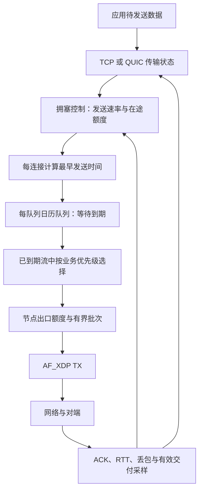

# XDP 全协议代理的传输性能设计提案

状态：PROPOSED，尚未实现或验证。分析基线为 `315af04`。

目标：在不把跨连接均分带宽或与其他拥塞算法的公平性作为优化目标的前提下，提高本项目有效吞吐、缩短业务完成时间，并控制自身排队、重传、CPU 和内存成本。保持默认 XDP/AF_XDP 全协议代理，不引入过滤专用 B 模式或 TC-BPF 后端。

本提案没有执行编译、测试、内核改动或网络部署。后续开发仍由用户手动运行 Devin；所有构建/实验在授权 VPS 或另行指定硬件进行。

## 推荐决策

采用完整的用户态模型驱动拥塞控制，以 BBRv3 为可复现参考；在参考实现通过验证后，增加面向本项目的路径探测策略。发送系统采用每连接发送时间控制、每队列日历队列和节点总出口预算。业务选择可以不均分带宽，但始终遵守接收窗口、拥塞在途边界与资源上限。

不承诺任何参数在所有网络上最优。最终选择取决于用户业务的有效吞吐与完成时间；持续高发送率、较大的 cwnd、网卡 TX 字节都不能单独作为收益指标。

推荐先构建可验证的传输系统，再以逐项实验决定算法偏离 BBRv3 的部分。不要把删除恢复机制、扩大常数或修改名称认定为新算法已经优化成功。

## 为什么不能把拥塞响应全部当作公平机制删除

BBRv3 的带宽估计、最小 RTT、在途上界、探测和恢复既影响竞争行为，也决定自身是否堆积无用队列、撞上 policer、进入持续重传。

当瓶颈只能交付 100Mbit/s 时，以 200Mbit/s 持续注入可能只增加排队与丢包，不增加成功交付。带宽探测要回答额外注入有没有带来额外交付；没有收益就应结束探测。这是本项目自己的效率约束。

可以把业务优先级、探测积极程度和共享瓶颈协调策略做成可配置策略，但不能去掉接收端流量控制，也不能将所有损失都判为随机丢包。单靠 RTT 未上升不足以区分随机丢包、浅缓冲拥塞和限速器丢弃；ECN 也只有在端点协商和反馈验证成立时才有意义。

## 数据面分工

应用优先级只能选择已经符合发送条件的工作，不能绕过拥塞窗口、接收窗口或协议恢复规则。TCP 与 QUIC 保持自己的序号、ACK、重传、加密和流控语义；共享的是拥塞模型接口与节点出口资源治理，不是生硬合并协议状态机。

## 拥塞控制模块

### 必须具备的输入和输出

输入应包括：发送/交付单调时间、累计 delivered/lost、在途数据、ACK/SACK 或 QUIC ACK range、RTT/最小 RTT/波动、接收窗口、应用受限标记、合法 ECN 反馈，以及本机 CPU/队列延迟信息。

输出包括：目标 pacing rate、cwnd/在途上限、探测状态、恢复状态与可观测原因。拥塞控制器不分配应用队列，也不直接越过 TX 资源额度。

delivery-rate 采样必须处理 ACK 压缩、延迟 ACK、重传和 app-limited 情形。不能简单用本次 ACK 字节数除以两次 ACK 到达间隔。协议识别的重传/交付语义通过 TCP 和 QUIC 各自适配器提供，不能把任意远端字段当作可信带宽反馈。

当前 smoltcp 的 Controller 钩子不足以直接复刻完整 BBR：需要补充交付采样与发送元数据、pacing 输出、协议恢复反馈，并审计计时和在途记账。仅给现有 window() 换一条 BDP 公式不构成 BBR 实现。

### 以参考实现为基础的定制方向

| 方向 | 设计 | 约束 |
|---|---|---|
| 新连接启动 | 用近期、同类路径数据作为有界先验，减少反复从零探索 | 不能按源 IP/CIDR 就认定带宽相同；先验有 TTL、置信度和上限 |
| 大流容量探测 | 在额外交付增加且本机/路径信号允许时更积极探索 | 设探测额度与结束条件，不维持永久高增益 |
| 小响应 | 优化已有合法窗口内的调度、连接复用、首批发送与路径预热 | 不任意扩大所有新连接初始在途量 |
| RTT 刷新 | 利用自然空闲测量降低额外探测中断 | 不能永久取消最小 RTT 刷新，陈旧模型会错误估算 BDP |
| 弱网损失 | 在多信号和置信度支持下避免把非拥塞损失过度放大 | 不支持可靠判断时保持恢复边界，不一律忽略损失 |
| 云出口限速 | 识别交付平台期及与注入相关的丢弃，约束总出口突发 | 单流历史不能替代节点出口上限，也不能合计不同路径估计作为物理带宽 |
| 同节点多连接 | 错开本节点自己的容量探测，避免一起挤爆共享出口 | 协调依据是实际共享瓶颈证据；不能把整个公网当成一个瓶颈 |

BBRv3 中具体哪些机制可以调整，必须对照固定源码版本和实验逐项决定。不要用“公平开关”这种并不存在的统一抽象描述整个控制器。

## TCP 状态、窗口与恢复

当前 smoltcp 没启用 Reno/Cubic，默认为 NoControl；RX/TX buffer 各 16KiB。这两项应先修复，见发布审阅 F3/F8。

传输缓冲需要与 BDP 和全局内存治理配合：

- 为连接分配有界初始缓冲，随交付证据增长，按节点剩余额度限制峰值。
- 发送缓冲需覆盖未确认数据；应用队列深度不能代替 TCP 在途容量。
- 接收窗口根据真实可保留字节额度通告；发送端 cwnd 与接收端 rwnd 分工保持独立。
- 关闭、超时、取消、重传缓冲和 Bytes 切片必须有完整字节记账。
- 审计并补齐 SACK/重排序/快速恢复、时间驱动丢失检测及尾丢包探测能力；具体保留和补充项由与现有 smoltcp 行为对照确定，不能把 BBR 误当作完整恢复算法。
- 协议时间使用单调时钟，避免系统时间调整影响 RTT、定时器和发送期限。

例如目标 100Mbit/s、RTT 100ms，BDP 约 1.25MB。该数值用于估算和预算，不能给 512 条连接无条件预留这么多内存。

## 队列调度选型

### 发送时间结构：分层 calendar queue / timing wheel

为每个有待发数据的连接维护一个下一次允许发送的时间；每条连接在定时结构中至多保留一个有效调度条目，取消/重用以 generation 标识防止旧事件推进新连接。

推荐每 XSK worker 一个分层时间轮或日历队列：近时间桶处理高频到期，远时间层处理长延迟；同桶按期限/业务选择推进。平均成本目标接近 O(1)，但必须处理热桶集中、回绕、过期条目和长暂停后的追赶。不能宣传最坏严格 O(1)。

以二叉最小堆实现一个清晰的参考调度器，验证释放时间和取消语义，并与日历队列比较；最小堆为 O(log N)，小连接数时未必更慢，不根据算法名直接淘汰。

不要每个报文创建 Tokio sleep，不扫描所有空闲连接。线程只等待最近期限、RX 活动和应用新工作。临近期限的短忙等须纳入 CPU 预算；2c2g 上持续占满两核会挤掉 TLS/HTTP/回源任务，降低节点总收益。

### 合法发送条件

发送必须同时满足：

1. 协议允许发送：cwnd 剩余、rwnd 剩余、恢复规则和数据准备完成；纯 ACK 等控制报文按其协议规则处理。
2. 连接 pacing 释放时间已到。
3. 节点/接口总出口额度可用。
4. 对应队列有可用 TX/UMEM 资源。

可简化理解为：下一批发送量不超过上述各项允许量的最小值。每次实际发送后，按字节数/目标速率更新下一次释放时间；时间基准不得将线程暂停期间的所有额度一次性补发成大突发。

### 已到期工作选择：业务优先级，不要求均分带宽

推荐有界优先级分层：

- 控制推进：协议要求的 ACK、握手、关闭和损失恢复，保留小额度，且响应与重传仍受各自的防护/恢复预算。不能无限置顶控制包。
- 对完成时间敏感的数据：首字节、交互流和较短响应；使用应用提供的优先级或有依据的期限。
- 大流：持续消费剩余可用带宽。所有请求都属于大流时，直接按发送时间推进即可。

已知剩余传输量时，可以评估 SRPT（优先剩余工作少的请求）以改善平均完成时间；未知长度、长流、加密透传不能伪造剩余大小。SRPT 并不同时保证每条大流完成时间最优。

不把跨流等分带宽列为要求，但最大排队年龄、资源持有期限和合法 ACK 的推进仍应受控，否则节点自身会因长期占用状态、超时重试而变慢。

### 节点额度与批次

拥塞控制是每连接的；网卡与云出口由所有连接共享。需要节点级出口 governor，再向 worker 分配短期字节额度；额度总和和可突发量可计算，避免每 worker 拿到完整节点额度。

额度调整避免每包跨核全局锁/原子热点，可以批量租用、在有界窗口回收。监控 wire bytes、有效交付、XSK 停顿和 CPU，而不是只看应用写入速度。

批量 TX 只聚合已到期且已获额度的报文，并限制最大序列化时间。若一次批次 B 字节以 R 字节/秒发送，其占用时间约 B/R；64KiB 在 10Mbit/s 上约 52ms，不能因为 batch 大就认为延迟更好。

QUIC 已有 pacer。连接级 pacing 以 quinn 的时序为准，公共 scheduler 负责节点额度和队列选择；若将 pacing 执行统一到公共层，必须显式接出 quinn 的发送期限。不能叠加两个彼此不知情的连接级整形器，然后仍用旧发送时间估算网络状态。

## fq、CAKE 与当前平台

AF_XDP copy TX 在目标 Linux 6.1 使用 direct transmit，绕过绑定 netdev 的普通 egress qdisc；generic 是入口挂载模式，不能推出 TX 经过 fq/CAKE。

因此主方案把 pacing、调度和出口限制实现在实际 AF_XDP TX 路径。普通回源 TCP 则保留内核 TCP，按实际支持选择 BBR 版本并检查有效算法，适当配置真正生效的 fq/mq 叶子；此处不要求更换为 B 组。

CAKE 适合掌握瓶颈带宽、可施加整形的出口节点，但不能作为当前 AF_XDP 的默认调度后端。对有明确带宽的云 vNIC，用户态总出口整形可以承担相应的注入控制；宿主机/运营商仍可能有不可见瓶颈。

| 候选 | 本项目决策 |
|---|---|
| 单一 FIFO | 不作为全业务发送结构，容易出现大批次队头阻塞 |
| 无界严格优先级 | 不采用，会让必要的数据/控制推进或资源回收失效 |
| WFQ/DRR | 不作为“均分带宽”的默认目标；未来有明确服务份额合同时再引入 |
| 最小堆 + 发送时间 | 正确性参考，也可在低/中连接规模直接使用 |
| 分层时间轮/日历队列 + 有界业务优先级 | AF_XDP 推荐目标结构，需和最小堆实测比较 |
| 内核 fq | 用于实际经过内核 qdisc 的普通 socket TX |
| CAKE | 按独立整形部署需求评估，不默认加入当前 dataplane |

## 可行性边界

- 普通浏览器/客户端不需要改协议即可使用节点发送端的新 TCP 拥塞算法；不会使对端发送端也自动使用该算法。
- 通用 TCP/HTTP 不能单方面增加自定义 FEC 或私有传输封装并期待普通客户端解码。只有双方可控的隧道/回源协议才可评估 FEC；它也消耗带宽与 CPU，应比较有效吞吐。
- QUIC 可以独立适配用户态控制器，但不能假设 quinn 当前名为 BBR 的实现等同指定 BBRv3 版本。需要版本标识与一致性测试。
- 对 smoltcp 做受控 fork 和 BBR 交付采样扩展在技术上可行；是否长期保留该 TCP 栈，要用协议兼容性、恢复行为和目标容量决定。抽象边界应允许替换 TCP 实现，避免业务层绑定 smoltcp 类型。
- 2c2g 是当前部署上限的一部分。忽略开发难度并不会消除 CPU、内存、定时精度和云出口上限；调度器与控制器自身开销必须计入结果。

## 实施与验收顺序

1. 先闭合发布审阅 F1–F8，建立 Cubic/现有 QUIC 的可用对照，修正时钟、窗口、字节预算和 overloading 行为。
2. 抽离协议反馈、拥塞控制、发送时间与 TX 提交边界，加入 delivered、inflight、rate、RTT、队列年龄、app-limited、重传和算法版本观测。
3. 实现按发送时间工作的参考 scheduler 与节点出口额度，再优化成分层日历结构；保留按相同事件轨迹核对两者行为的测试。
4. 选择并记录一个 BBRv3 上游 commit，实现用户态采样/算法/协议适配，先保持参考语义。通过可复现 ACK/丢包轨迹以及远程真实 TCP/QUIC 试验。
5. 分别试验路径先验、探测强度、同节点探测协调与业务选择策略，每项单独开关；仅保留对目标工作负载有效的改动，不把所有参数同时放大。
6. 在私有 netns/veth 与云 vNIC 上做代表性组合测试：低/高 RTT、随机与突发丢包、浅/深缓冲、policer、上下行不对称、ACK 压缩、容量突变、CPU 饥饿、应用暂停与多个业务流。竞争流测试用于衡量真实业务交付，不要求公平性评分。
7. 弱网必须施加在真正经过的链路上，验证 netem/整形计数；不要只在 AF_XDP 绕过的 qdisc 上设置参数。记录最终 release 工件与全部算法/配置版本。
8. 以成功业务字节/秒、业务完成时间、P99、重传字节比例、CPU/Gbit、RSS、出口队列时间和过载恢复评估。单连接和整节点都要有结果；发生器或 2c2g 达到极限时如实标注。

## 参考依据

- [Google BBRv3 说明](https://github.com/google/bbr/tree/v3)
- [Google BBRv3 控制器源码](https://github.com/google/bbr/blob/v3/net/ipv4/tcp_bbr.c)
- [Linux 6.1 AF_XDP copy TX](https://github.com/torvalds/linux/blob/v6.1/net/xdp/xsk.c#L514-L577)
- 当前 Cargo.lock：smoltcp 0.14.0 / quinn-proto 0.11.17。已静态核对其本地 registry 源码；未在本机执行 cargo。
- [发布前静态审阅与 F8](../tasks/xdp-final-static-review-2026-09-15.md)
