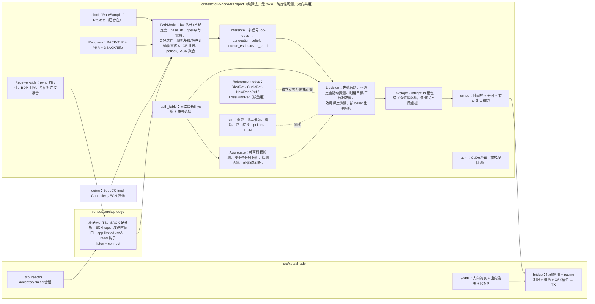

# XDP 全协议接管的传输层：统一拥塞控制 EdgeCC / AccECN / 用户态队列调度 —— 规划 v3.2 与一次性执行提示词

规划原始基线：`0edcee0`（静态审阅基线 `a26b15c` + 文档脱敏）；本次复核代码基线：`a094602`。
当前进度：T1/T2 基础层、T3 fork、T4 回源接管已有代码及 EN-18/19/20/21/22/24 报告；EN-24 报告双栈矩阵、外拨、IPv4 PTB、守卫、Cubic 同事件对照通过，但明确发现 F1 reload 存量会话冻结。**T4 不能标记完全验收，F1 未闭合**；IPv6 PTB 在线注入、真 NIC zero-copy 仍未验证。T3 同事件对照只证明已测行为与差异，不等于逐 ACK 一致或性能等价；独立报文脚本覆盖仍需核账。T4-9 与 T5–T10 尚待实现/验收。本次只复核代码、已有报告与 RFC，没有重跑这些测试。
上游输入：`tasks/xdp-final-static-review-2026-09-15.md`（F1–F8）与 `docs/xdp-transport-performance-design.md`（PROPOSED）。

本文只做静态阅读与依赖源码核对，未编译、未运行、未连接 VPS。所有编译/测试/压测仍按既有约束在授权 VPS 执行。

**开发/编译主机（2026-09-16 用户提供）**：`devin-build-90`（103.79.184.90，root，SSH key/别名已配置；代码树 `/root/cloud-node-rust`）。历史报告：Debian 12 / kernel 6.1.0-41 / 8c / 约 15GB RAM，transport 测试通过；本轮未重新连接验证。实际工具链以仓库 rust-toolchain、Cargo 配置及远端检查为准：`cargo xtask build-ebpf` 当前使用 `bpfel-unknown-none` 与独立 pinned nightly，不再凭旧文案断言所需 linker。记录实际链接器、offload、CPU flags、队列和对象 SHA；`target-cpu=native` 的产物不能自动当作其它 CPU 可部署产物。沿用构建缓存，不重装现成工具链；其它 VPS 的网络测试须处于已授权隔离范围。

## 范围声明

1. 目标是 **XDP/AF_XDP 接管业务数据面**：被终结的 TCP 由 `smoltcp-edge` 承载，QUIC/H3 由 Quinn 承载并共用 EdgeCC，普通 UDP/透明转发由相应转发路径承载。显式选择 AF_XDP 的回源不能静默落回内核；迁移期默认不在开发任务中擅自切换。
2. **非 XDP 模式不做传输改造**，只在 T10 作为同环境对照基线。共享 Quinn/demux 代码的改动必须按 XDP 会话作用域接入，不能顺带切换所有 Endpoint。
3. 拥塞控制交付物是 **一个控制器 EdgeCC**，不是多个算法并列。Reno/Cubic/BBRv1/BBRv3 的机制可作为部件；参考控制器只用于验证。允许共用采样/恢复基础设施，但参考状态机须独立核对上游，不能假定改几个 EdgeCC 参数就等价于 BBRv3。
4. 控制面（配置、RPC、DNS、健康检查、日志上报）保留内核 socket。
5. 普通 UDP 和未终结的 TCP/QUIC 不会因节点安装 EdgeCC 而自动获得端到端发送控制；只能通过本地调度/AQM改善。直接 NAT/splice `XDP_TX` 绕过用户态 TX，必须核对覆盖面，不能把 AF_XDP 队列整形宣称成整台主机出口整形。

## v3 相对 v2 的改动

- 第 2 节整体重写：从"三个控制器 + 策略叠加层"改为统一控制器 EdgeCC 的分层设计（路径模型 → 多信号推断 → 决策 → 安全包络 → 聚合协调 → 接收侧控制）。
- 补入 v2 遗漏的 BBRv1（丢包盲响应、`lt_bw` policer 判定）以及 BBR 家族之外的机制来源：PCC-Vivace 的效用梯度、Copa/Swift 的时延目标控制、GCC 的时延梯度滤波、Veno 的队列占用判据、RFC 3124 Congestion Manager 与 RFC 8382 共享瓶颈检测、DCTCP/RFC 8257 的 alpha、接收窗口驱动控制。
- 路径质量表并入路径模型的长期存储；路径选择（原 T4b）与聚合协调合并为 T6。
- 任务 T2 之后全部重排；提供暂停后的"继续提示词"。

## 0. 硬约束（原始依赖限制与当前接线风险）

C1–C5描述fork前的上游限制，T3已实现相应钩子；不是当前代码仍完全缺失。当前风险以本次标注的代码/接口和§10为准；历史行号不能代替实现前重新定位。

| # | 事实 | 证据 | 影响 |
|---|---|---|---|
| C1 | smoltcp 0.14.0 `Controller` 为 `pub(super)`，`on_ack(now, len, in_flight, rtt)` 无 per-segment 发送时间/delivered/app-limited/SACK | `smoltcp-0.14.0/src/socket/tcp/congestion.rs:14-37` | 交付率模型无法外部注入，必须受控 fork |
| C2 | RTT 一窗一样本，不用 TS 选项，ms 精度 | `socket/tcp.rs:163-242, :2143` | 需要 TS 每 ACK RTT 与 µs 时钟 |
| C3 | 发送侧无 SACK 记分板/RACK-TLP/PRR；丢失只靠 3 dupack 与 RTO | `socket/tcp.rs:512-523, 2106-2137` | 交付/丢失记账不可信，任何模型型 CC 都会被误导 |
| C4 | socket 层无 ECN；`TcpRepr`/`Ipv4Repr` 未上提 ECN 字段 | `wire/tcp.rs:856-869`, `wire/ipv4.rs:533-539` | 经典 ECN 与 AccECN 都要 fork 贯通 |
| C5 | 无 pacing 钩子：`cwnd_remaining = window - flight_size` | `socket/tcp.rs:1400-1405` | 发送时间门必须加在 dispatch |
| C6 | reactor 曾用墙钟 ms（T1 已改为单调 µs `TransportClock`） | `621b728` | 已闭合 |
| C7 | bridge 直接提交 TX；当前 ring 满计数并丢帧但不退出，真实设备错误才隔离 | `src/xdp/af_xdp/bridge.rs:1169-1213`（a094602） | T8 必须补有界背压/重试；不能把本地未发送的丢帧伪装成链路丢包 |
| C8 | quinn-proto 0.11.17 Controller 公开，但 ACK 回调无 packet number/发送时 delivered 快照，CE 回调仅事件；factory 无地址参数 | `src/congestion.rs:17-102`（本地锁定依赖） | trait 可接入不等于信号完整；必须证明采样重建和路径注册正确，缺失字段不能伪造 |
| C9 | Quinn Pacer 以 `1.25×window/srtt` 补令牌，不消费 controller pacing 指标；metrics 是 bits/s，transport 是 bytes/s | `connection/pacing.rs:48-112`、`congestion.rs:95-96` | D-C1 先量实际 TX；单改 pacing.rs 未必能传入独立速率，超出已批 patch 面须先申请 |
| C10 | quinn 内置 `Bbr` 为 quiche 派生 BBRv1，标注 Experimental | `congestion/bbr/mod.rs:19-24` | 不用；与我们的模型层不能共享状态 |
| C11 | H3 共享 UDP 套接字丢弃 ECN | `src/quic_udp_demux.rs:163-180, 717` | 既有静默降级，先报告 |
| C12 | T4 已实现主动打开、OUT_CT、守卫和代理回源接线；F1 尚未闭合 | EN-20/21/22/24 | 不重做接管；继续补生命周期与覆盖证据 |
| C13 | AccECN = RFC 9768；目标 6.1 不能当作原生 AccECN 对端 | RFC 9768；EN-24 环境 | 独立对端/报文脚本实测，不能以对端版本号代替能力验证 |
| C14 | 6.1 AF_XDP copy TX 绕过 egress qdisc | `xsk.c` | fq/CAKE/FQ-PIE 必须在用户态 TX 路径重做 |
| C15 | eBPF `tcp_sanity` 不动 ECE/CWR/AE；challenge 路径 SYN-ACK 仅 MSS | `ebpf/main.rs:1369-1390, 4940` | challenge 路径不协商 ECN，显式限定 |
| C16 | quinn `send_window=32MiB` 为每连接 | `src/quic_transport.rs:13-19` | 进 F3 预算，修注释 |
| C17 | 内核对无监听端口的 SYN-ACK 回 RST；XDP detach 窗口漏包到内核 | Linux TCP 语义 | 回源源端口需 `ip_local_reserved_ports` + netfilter DROP 守卫 |

上游版本钉住：google/bbr `v3` @ `90210de4b779d40496dee0b89081780eeddf2a60`；`draft-ietf-ccwg-bbr-06`；RFC 9768（AccECN）、3168、8985（RACK-TLP）、6937（PRR）、9438（CUBIC）、9406（HyStart++）、7323（TS）、2883（DSACK）、3522（Eifel）、8257（DCTCP）、8382（共享瓶颈检测）、3124（Congestion Manager）、8305（Happy Eyeballs）。BBRv1 参考 Linux 6.1 `net/ipv4/tcp_bbr.c`（含 `lt_bw` 长期带宽/policer 判定）。PCC-Vivace（NSDI'18）、Copa（NSDI'18）、Swift（SIGCOMM'20）、GCC（RMCAT）、Veno（JSAC'03）为机制来源，不是实现对象。

## 1. 目标架构



## 2. EdgeCC：统一拥塞控制设计

### 2.1 设计原则

1. **共享瓶颈需要证据，不等于相同目的前缀。** 每条流保留自己的传输记账与 RTT 底线，只有经过验证的共享瓶颈组才协调预算和探测；预计减少同步超冲，但不承诺 N 倍收益。
2. **用多信号推断，不把 belief 当已校准概率。** 丢包、RTT、平台期、CE、ACK 聚合相互相关，必须去重、按轮归一化并验证误判率；无排队时延不等于无拥塞，浅缓冲/AQM/反向路径会造成反例。
3. **探索有独立安全约束。** `inflight_hi` 只有建立且有效时才约束输出；还需要发送/内存预算、最大探测剂量与持续丢包/RTO反应。不能声称一个同样依赖证据的包络必然纠正所有推断错误。
4. **目标函数显式。** 业务有效吞吐与完成时间为正项，自身排队时延与拥塞丢包为代价项，权重由业务分层给出；同一函数既用于探测决策也用于 T10 评估。
5. **用代理知道而端点不知道的一切：** 两侧速率、同路径的历史与并发流、业务优先级、我们是接收方时的窗口控制权。
6. **可审计。** 每次模式/包络/分配变化带原因码；同一事件轨迹可确定性重放；每个机制有消融开关（用于度量，不是生产可选项）。

### 2.2 路径模型（PathModel）

流级保留 RateSample、RttState/base_rtt、恢复、app-limited 和本流模型；聚合级另维护同步时间窗口内的交付总量、共享瓶颈证据与总额度。不能把每流 delivery-rate 直接轮流喂给同一 EWMA 当作总带宽，也不能将一条流的最小 RTT直接套到另一条流。跨 worker 用分片所有权和有界摘要交换，禁止每 ACK 争用节点全局锁。

| 量 | 估计方法 | 来源 |
|---|---|---|
| `bw_max` | 交付率窗口最大值滤波（窗口 ≈ 2 个探测周期） | BBR |
| `bw_est`, `bw_sigma` | 非 app-limited 交付样本的 EWMA 与偏差EWMA形成不确定度代理；样本年龄/数量参与，未经校准不称统计置信区间 | 新增；不确定度驱动探测 |
| `bw_hi` / `bw_lo` | 剂量-响应试验（提升 inflight 后交付率是否随之增长）与响应事件更新 | BBRv3 概念，更新规则由 belief 驱动 |
| `base_rtt` | 本流长窗口最小值+漂移候选；低inflight下持续升高也可能是反向拥塞，结合路径变化/样本质量后再更新，组摘要不替代本流底线 | BBR + 新增 |
| `qdelay`, `qdelay_grad` | `srtt − base_rtt`；梯度用 Kalman/EWMA 滤波 | Copa/Swift/GCC |
| `extra_acked` | ACK 聚合补偿 | BBRv3 |
| 丢包过程 | 两列丢包率（伴随 qdelay 抬升 / 无抬升）、突发长度、**因果检验**（丢包率是否在我们提速后上升）、伪重传比例（DSACK/Eifel） | Veno 队列占用判据 + 新增 |
| `p_rand` | 由"无 qdelay 抬升、无 CE、非提速期"的丢包样本估计的随机丢包基线，带置信度 | 新增；对高丢包国际链路关键 |
| `alpha` | 按可用反馈精度求EWMA；AccECN字节选项、ACE包数、QUIC包数及经典事件分开，记录估算误差 | DCTCP/BBRv3 |
| `lt_bw` / policer | 持续丢包+平台期是候选证据，跨窗口验证令牌桶速率/突发行为并支持退出，避免误限普通瓶颈 | BBRv1 |
| `delay_signal_quality` | 低 inflight 时 RTT 方差；决定时延信号是否可用 | 新增 |

长期存储 `path_table`：按 `(egress_iface, local_ip, af, dst_prefix)` / `(ingress_iface, local_ip, af, client_prefix)` 保存聚合摘要（`bw_est`、`base_rtt`、`p_rand`、`alpha`、乱序度、connect_rtt、失败率），TTL 与置信度；供暖启动与拨号选择。

### 2.3 多信号推断（Inference）

- `congestion_belief ∈ [0,1]`：有界 log-odds 累加器，每 RTT 衰减。证据权重从强到弱：CE（AccECN 比例 > 经典事件）> `qdelay` 超出该分层预算且梯度为正 > 伴随 qdelay 抬升的丢包 > inflight 上升而交付率平台期 > 无抬升的丢包（权重为 `(loss_rate − p_rand)+`）；DSACK 判定的伪重传为负证据。
- `queue_estimate ≈ qdelay × bw_est` 是有噪声的队列代理量，不是本流实际占队字节；反向排队、竞争流和 ACK 压缩必须进入信号质量判断。经典 ECN 事件、AccECN ACE 包数、AccECN 字节选项、QUIC ACK_ECN 包数分别标记精度，不能混成精确 CE 字节比例。D-D2 仅限制推断权重，不取消已协商 ECN 的反馈或基本拥塞响应。
- 共享瓶颈检测（RFC 8382 思路）：同候选聚合内各流的 qdelay 变化与丢包时刻相关性；相关则合并，去相关则拆分——防止错误分组造成的欠利用。
- 所有推断为每 ACK O(1) 的滤波器更新，不含在线学习。

### 2.4 决策（Decision，聚合级 → 流级）

- **工作点**：`inflight_target = bw_est × base_rtt + Q_budget(tier)`；`pacing = bw_est × g`。`Q_budget` 是我们接受的自排队量，由业务分层给出（完成时间敏感层小，大流层大）。
- **双模控制**：`delay_signal_quality` 高 → 时延目标控制（Copa/Swift 式：速率按 `(d_target − qdelay)/d_target` 的有界比例调整）；时延信号被抖动淹没 → 平台期驱动探测（BBR 式）。切换带迟滞并记录原因。
- **不确定度驱动探测**：探测触发 = `bw_sigma/bw_est` 高、或距上次剂量-响应试验超过与 RTT 成比例的随机化 horizon、或先验显示更高容量；探测幅度与不确定度成比例（有上下限），时长 ≥1 RTT；用交付率增量/inflight 增量判定接受或回退。**同一聚合同时只有一个流在探测**，其余保持。
- **效用梯度微调**（PCC-Vivace 思路，受限使用）：保留成对 ±ε 试验及 `U = goodput^a − b·(rate·qdelay_grad)+ − c·rate·loss_congestion` 原型，但实现前固定各项量纲/归一化、a/b/c、噪声门限、观察窗与冷却时间，避免任意单位改变结果。仅在非 app-limited、寿命 ≥5 RTT 且样本稳定时参与同一个探测协调器；不得与带宽探测同时叠加增益。输入/输出均受包络和预算约束，不取代模型；按 D-E2 完整实现并消融，生产默认待 T10。
- **按置信度比例响应**：保留 `inflight_lo = inflight × (1 − β·belief)` 原型与 PRR；同一轮同一 CE/丢包不得经模型、推断、包络重复累计削减。CE 比例充分时评估 alpha 型响应，经典事件不能冒充精确 alpha。RTO/QUIC persistent congestion 必须尊重协议恢复规则、退避与进展要求；路径先验只能在重新获得有效交付证据后有界恢复，不能凭陈旧 BDP 立即发满。`belief≈0` 不免除持续丢包、policer、无进展和资源上限的安全反应。
- **启动**：有置信先验时以约 0.5×先验带宽、1.5×先验 BDP 作为候选，经初始窗口/资源上限裁决并立即验证；无先验时 2.77 为待核对来源的候选 pacing gain，不是盲目把 cwnd 每轮乘 2.77。平台期/HyStart++/丢包与 CE 负责退出；TCP 无先验默认 10 MSS，QUIC 遵守本协议初窗/反放大约束。先验过期、容量骤降、无 RTT 样本与 idle restart 都要有有界路径。
- **base_rtt 刷新**：保留本流自然空闲/低 inflight 样本，组内其它流只作参考证据；一个探测者下探不保证共享队列会排空。若无法取得无队列样本则降低置信度，不伪造新底线。协调下探与恢复、带宽探测、效用试验，具体幅度/持续时间核对固定参考实现。
- **app-limited**：真正应用受限样本不下拉 `bw_est`，不触发探测；另区分 rwnd/QUIC flow-control、调度租约、本地 TX 背压限制，不能一律标成应用受限而掩盖拥塞。
- **单一控制权**：恢复/安全响应优先，其次启动与排空，再到正常工作点和探测；每轮仅一个动作提交者。保持 transport 纯算法、统一单调时基及 bytes/s 单位，适配边界显式转换 bits/s。相互作用消融至少覆盖 探测×聚合、ECN×belief、rwnd×pacing。

### 2.5 安全包络（Envelope）

- `inflight_hi` 由强证据设定：一轮内伴随 qdelay 抬升的丢包 ≥ 阈值、CE 比例 ≥ 阈值、RTO、policer 判定 → `inflight_hi = 当时 inflight × (1 − headroom)`。
- 只有 belief 连续 K 轮低于阈值才允许 REFILL → 上探（BBRv3 语义）。
- 决策层与效用微调层输出一律 `min(·, inflight_hi)`；节点出口租约再叠一层。
- 下调上限时已在途数据可暂时大于新上限；此时不再放行新增数据，不能要求已在途字节瞬间消失。分别定义目标窗口、可新增信用与恢复探测预算，不能比较不同量纲的速率/窗口。
- 覆盖 unset、零/小于 MSS、重复收紧、饱和算术、空闲、MTU/路由变化和 REFILL 活性。当前 `Envelope::set` 可得到 0，乘法 REFILL 仍为 0，必须在恢复协议中解决永久停发；禁止先 clamp 再偷偷 max(MSS) 越界。安全性与活性都要验证，而非只测 clamp。

### 2.6 聚合协调（Aggregate，RFC 3124 思路）

- 候选键 `(egress_iface, local_ip, af, dst_prefix, port_class)`；新流先加入候选，共享瓶颈检测确认后共享模型与包络，否则退化为单流聚合。
- 分配：聚合 `rate_total`/`inflight_total` 按业务分层权重分配（T0 控制推进与 T1 完成时间敏感有最低保证），工作保持，未用份额每 RTT 再分配。
- 协调：一次一个带宽/效用探测者，故障/超时能归还探测权；共享可信路径摘要，不共用未经归一化的绝对 RTT。Σ已分配 ≤ 聚合额度，工作保持时饱和使用可用额度；合并/拆分、退出、跨 worker 与 reload 不能双记额度。
- 共享瓶颈检测不放在逐 ACK 全成员两两比较中；用有界采样、候选数量上限和周期任务，避免 O(N²) 热路径。无确证时维持单流控制不是关闭 EdgeCC。测试同前缀不同瓶颈、不同 RTT 同瓶颈、并发到达、相关无线丢包误判。
- 收益预期是减少重复探测与同步超冲，具体幅度只能由 T10 量化；协调一个流的下探不保证其它流维持负载时能测得真实 base_rtt。

### 2.7 接收侧控制与配对连接耦合（代理特有）

- `consumer_drain_rate × (srtt + margin) + Q_budget_rx` 与 `BDP_est + Q_budget_rx` 是接收额度候选，不是无条件改写已承诺窗口。TCP 不撤销已通告右边界，预留已承诺字节，正确推进零窗口探测/重新开窗；QUIC MAX_DATA/MAX_STREAM_DATA 与 HTTP/2 WINDOW_UPDATE 不可撤回，限制后续增量并计入 F3。
- 配对耦合目标是减少两侧速度不匹配的节点排队，不保证消除远端瓶颈排队。下载/上传对称；H2/H3 以 stream 与 connection 两级区分，不能让一个慢 reader 阻塞其它 stream。缓存命中、共享 cache-fill、多消费者、后台缓存填充、压缩/解压需使用真实消费者与字节映射，不能把一个客户端速率直接当整个源站连接窗口上限或破坏缓存语义。
- 保留 app-limited 的真实原因，排队量与平滑速率共同驱动耦合，设置迟滞防止 rwnd/pacing 两环自激。ACK 策略普通路径不随意改变；AccECN 必须执行 RFC 9768 的反馈触发规则，不能用固定 delayed-ACK 策略覆盖规范。

### 2.8 恢复

RACK-TLP（`reo_wnd` 自适应）+ PRR + DSACK/Eifel 撤销；在 `p_rand` 高且乱序低的路径收紧 `reo_wnd` 加快修复；TLP 参数对长 RTT 调整。

### 2.9 校验模式（不是交付物）

`Bbr3Ref` 按固定 google/bbr v3 源码独立核对 STARTUP/DRAIN/ProbeBW/ProbeRTT、inflight_hi/lo、ECN、恢复与常数；可共享底层部件，不能仅通过 belief 参数声明等价。`CubicRef`/`NewRenoRef` 是现有校验模式；`LossBlindRef` 是关闭 belief 丢包反应的实验对照，不等同于完整 Linux BBRv1。参考与 EdgeCC 共用模拟链路但各自闭环发包；固定 ACK 轨迹只用于机制差分，不用于吞吐排名。T10 对目标弱网吞吐/时延收益、正常网络非劣化和资源成本联合评估，未满足则不切默认；不能保证 EdgeCC 在所有路径上优于已有算法。

### 2.10 明确不采用

- 数据面内在线学习/强化学习（Remy/Aurora/Orca 类）：不可审计、CPU 不可控。T10 数据允许离线参数拟合（D-G1），但任何拟合结果要进数据面仍需走 T10 同环境验证。
- L4S/ECT(1)/Prague；MPTCP；通用 TCP 上的 FEC。
- quinn 内置 `Bbr`。

### 2.11 风险（如实）

- EdgeCC 是待验证的新控制器，不是已证明优于 BBRv3 的产品；协议回归、独立参考、闭环仿真和真实流量共同构成证据。
- 效用微调在 300ms RTT 上收敛慢，多控制环可能振荡；必须测长时间稳态、混合流和相关机制消融。
- 共享瓶颈误合并会欠利用；过时先验、反向排队和浅缓冲可能误导推断。
- 每 ACK O(1) 不等于廉价；记录每 ACK CPU、分配数、跨核同步、cycles/byte、CPU/Gbit、空闲 CPU和高并发 RSS。拥塞分类/相关性分析不准把无界扫描带进热路径。
- AF_XDP copy 仍有内存复制，当前 reactor TX 有逐包 Vec 分配；用户态调度可能损失 GSO/批量优势。吞吐收益必须扣除 CPU、重传、队列和复制成本，不预设高于内核路径。

## 3. AccECN（RFC 9768）双角色设计

以 RFC 9768 正文与测试向量为准，位序统一写作 (AE,CWR,ECE)。被动方响应 (1,1,1) 与经典 (0,1,1)，SYN-ACK 编码按 §3.1.1；保留编码的接收处理按 §3.1.3，不能反向把接收容忍当作合法发送编码。

**§3.2.3.2.1 明确禁止初始 SYN 携带 AccECN TCP Option**，因此没有“TOA 与 AccECN Option 在初始 SYN 中争抢空间”的问题。SYN-ACK/后续 ACK 的选项探测、裁剪/反馈频率按 §3.2.3；SYN 重传按 §3.1.4.1，握手模式不可混用等规则按 §3.1.5。覆盖三次握手、SYN/SYN-ACK 重传、第三 ACK 丢失、选项被中间盒剥离、ACE 回绕/零化/旧 ACK、段合并和计数器初始化。ACE 以包计，选项以 payload 字节计，不能互相冒充。

数据 ECT(0)、普通纯 ACK Not-ECT，反馈严格依规范；classic ECN 与 AccECN 的响应分开去重。两条被终结 TCP 半连接独立协商，不能把一侧反馈原样复制给另一侧。challenge 不协商仍是既定边界。客户端被动响应常开、回源主动通告默认关（D-D1）；D-D2 不授权忽略有效 CE。AccECN 是反馈协议，不会自动赋予 EdgeCC 稳定性或 DCTCP 在公网部署的全部前提。

## 4. 用户态队列调度（fq/CAKE/FQ-PIE 的用户态重做）

每流 `next_send_at` + 分层时间轮（最小堆参考、等价测试）；业务 T0/T1/T2 共用权重、工作保持且低层不饿死。CAKE 式时间 deficit、overhead 补偿、节点租约按 `xdp.egress_rate_bps` 配置生效，无配置不整形。rate×1ms 是批量目标，单帧序列化时间可能更长；实际出站窗口上界包含一帧 packetization 误差，不能拆坏报文或因 token 小于 MTU 永远停发。

发送资格同时满足 transport 信用（TCP cwnd/rwnd 或 QUIC cwnd/flow-control）、pacing deadline、调度租约及 XSK 槽位，各量纲在边界统一。端点内部与 bridge 不重复计算同一节奏债务；对进入长期本地队列之前已触发 on_sent 的路径，量化并解决虚假 RTT/重传计时，不能仅在 wire 前额外塞一个深队列。

普通背压有界等待/唤醒、保留已接收 payload 与 F3 许可，不以 worker 退出或静默丢帧伪装成功；ACK、ARP/NDP、ICMP、握手/恢复用有界控制预算保障进展，不绕过总体资源上限。时间轮回绕/取消/generation、跨核租约回收、reload与UMEM completion都要可证明不重复持有。

CoDel 仅作用于真实转发队列，按实际入队/出队 sojourn、interval/min-delay/drop schedule 实现；ECT 可 CE，Not-ECT 按已批准 AQM 策略丢弃，保持 DSCP 并更新 IPv4 校验和。不能用简单 delay 阈值打 CE 冒充 CoDel，也不能把端点已可靠接收的数据丢弃当 AQM。NAT/splice 直发路径须接入既定治理或明确列为未覆盖阻塞项，不允许默默关闭卸载。

## 5. QUIC 路径

在适配层包装纯算法 EdgeCC 实现 Controller/ControllerFactory，不把 Quinn/Tokio 反向引入纯算法 crate。先做能力证明：批量发送、相同 sent 时间、ACK ranges、多个 packet-number space、loss/persistent-congestion、路径更换、clone_box 与聚合注册注销；不能用 acked_bytes/srtt 冒充 delivery sampler，也不能为匹配时间戳无界保留发包历史。Factory 无地址参数，需要由实际 Endpoint/路径上下文绑定，不能只凭全局 factory 推断五元组。

C8/C9 是接线风险，不是假定已解决：完整采样/CE计数或独立 pacing rate 若在现有公开接口和 D-C1 允许的 patch 范围内无法实现，提交最小必要 API/调用点变更方案请求审批；禁止改 cwnd 假装 pacing gain 已生效，或把只具部分信号的 TCP/QUIC 控制器声称完全一致。修 C11 时贯通 XDP 收包的 ECN、目的地址和发包 TOS/TC，测试 CE/ECT0/ECT1/Not-ECT 与 DSCP 保留；quinn 的 ECN 验证仍有效，不能关闭验证使测试变绿。`send_window` 与协议内部缓冲纳入 F3。

## 6. 回源方向由 XDP 接管

T4 已有主动打开、保留源端口、路由/邻居、PMTU、虚拟流适配、OUT_CT 与内核守卫；接线见 EN-20/21/22。当前配置键是 `xdp.upstream.mode=kernel|afxdp`，显式 AF_XDP 不允许隐式内核回退。继续完成生命周期和验收，不再重写一套拨号层；生产默认与开关移除遵循 T10/D-B4 的发布审批，不随“代码完成”自动切换。预算覆盖两侧会话及真实协议缓冲；H2/H3 多路复用不能简单用“两条 TCP”估算全部内存。

### 6.5 国际网络：路径多样性与选择

（保留 v2 内容，数据结构改为第 2.2 节的 `path_table`）杠杆：L1 源站候选按测得质量选择 + Happy Eyeballs 有界竞速；L2 源 IP/出接口/源端口重掷（仅在证明 ECMP 多样性时）；L3 父节点中转（仓库已有 `level`/`parentNodes`，`lb_factory.rs:244-246` 目前忽略）；L4 路径先验进 EdgeCC 启动与 `p_rand`；L5 幂等 cache-fill 传输中换路（默认关）；L6 客户端方向无换路能力，只导出前缀级质量给控制面。被动测量为主，主动 SYN 探测限速为辅，不用 ICMP；ε-greedy 探索 + 迟滞；连接池键含路径。

## 7. 验证策略

1. **三类证据分开**：固定事件重放用于记账/状态差分；闭环仿真让各控制器在同一链路配置、独立可复现的外部随机过程下自行发包；真实 netns/vNIC 验证完整协议与实际 TX。不能把同 ACK 轨迹的结果当作吞吐对照。当前 sim 的 SACK-lite/dupACK 恢复、无反向排队及阈值式 `CodelEcn` 是简化模型，必须补反向瓶颈、ACK loss/compression、真实 CoDel 与真实栈对照，不能拿简化模型宣称生产协议验证通过。
2. **安全与活性**：有限值/无溢出；新增发送信用与包络/F3/租约一致；收紧包络后的在途超额能排空；零窗口/小于 MSS 的包络可恢复；聚合同时探测者 ≤1、分配总和 ≤总额度且工作保持；预算恰好释放一次；正常及失败 reload 都保住旧连接；有限输入下无死锁/永久冻结。belief 单调测试限定“其它输入和衰减相同”，不是混合证据下的全局单调。
3. **不可缩减的矩阵清单**：统一原 T5/T10 的 RTT 取值，RTT {5,10,50,150,300}ms × loss {0,0.1,1,3,5}% × bandwidth {10,100,1000}Mbit/s × buffer {0.25,1,4}BDP × policer {无,有} × jitter {无,有} × concurrency {1,10,100} × direction {客户端,回源,双侧}。IPv4/IPv6 协议矩阵覆盖 TCP、UDP、HTTP/1.1、HTTPS、H2、SNI、QUIC/H3，含小对象/长流、上传/下载与缓存命中/回源。另加乱序/突发丢包、容量骤降、长连接、多路径互换/黑洞、共享瓶颈误并/误拆、反向 ACK 瓶颈、慢源站/慢读/取消与 reload 故障注入。
4. **比较与消融**：EdgeCC / Bbr3Ref / LossBlindRef / CubicRef / NewRenoRef 同栈；内核路径为相同代理业务的外部基线，记录实际 CC/qdisc，不用内核 BBRv1冒充 BBRv3。不确定度探测、效用微调、聚合、先验启动、接收侧、p_rand、双模逐项关闭，另测关键交互（§2.4）。保留不同 RTT 的混合竞争流测试；不做均分优化不等于允许饿死其它流。
5. **防止为结果调门槛**：先保存基线、测量噪声、业务目标、通过阈值与运行清单，再冻结最终验证集；离线拟合与验证 seed/轨迹分离。所有已列格子/重复试验均须出结果，不仅选有利格子。报告样本数、分位数、置信区间/波动与最差回归，不用平均吞吐掩盖 P99/失败。x/y 阈值由基线与目标形成并冻结，不能观察 EdgeCC 最终成绩后下调。
6. **真实链路与工件**：netem 放在 AF_XDP 真实会经过的对端/中间 netns 链路，计数器确认；不假定本机 egress qdisc 能约束 AF_XDP。记录 release SHA、对象 SHA、kernel、linker/CPU flags、网卡/队列、copy/ZC、offload、CPU affinity、ACK策略、种子、暖机/运行长度和退出码。优化迭代用相关快速测试，最终按清单跑完完整矩阵；缓存已有结果必须匹配相同源码/参数/工件，不借此漏测。
7. **外部边界不伪造**：zero-copy/硬件多队列需支持 NIC；真实公网 ECN 支持率需授权样本。缺环境则逐项保留阻塞及可执行复测入口，不写 VERIFIED，也不自行缩小原验收。云 vNIC/copy 的实测不能替代 zero-copy 性能结论。
8. **发布门禁**：正确性/保连接/无越界为硬门槛；吞吐、FCT/P99、重传/伪重传、队列时延、CPU/Gbit、每 ACK 开销、RSS与空闲 CPU联合评估。提升是待证假设，不保证所有格子优于 BBRv3；失败应改进实现或明确阻塞，不靠关功能、改测试、断连重建取得通过。最终只给默认切换建议，仍等待发布审批。

## 8. 一次性连续交付：唯一子代理提示词

以下整段一次性交给同一个执行代理。T4-9/T5–T10 只作为需求与证据编号，不是需要用户逐条派发的任务；允许内部里程碑和多个可审查提交，但不因到达编号边界停工。T11 仍遵守条件授权，不能因“一次完成”自动启动。

```text
任务：一次性连续完成 tasks/xdp-transport-next-steps-2026-09-15.md v3.2 的全部后续必选工作：F1 跨代保连接修复（T4-9）、T3/T4 验证债、EdgeCC 决策与 TCP/QUIC 接入（T5）、聚合与选路（T6）、AccECN/ECN（T7）、调度/出口治理（T8）、接收侧耦合/AQM/缓冲（T9）、最终矩阵/消融/默认建议（T10）。实现、集成、验证、修复和证据一并交付，不只做规划、原型、接口或其中一项。

执行约束：
- 先读本文件全文、no-unapproved-degradation 规则、EN-18..22/24 与当前源码；git status/diff/log 核对 a094602 之后的真实改动。不 reset/覆盖他人 WIP，不按旧 SHA 回退。发现既有缺陷先报告触发条件、影响和证据。
- 本机只编辑/静态检查；编译、测试、eBPF和压测在 devin-build-90（103.79.184.90，SSH别名，/root/cloud-node-rust）的授权隔离目录/netns/veth完成。先核对目录归属，不清生产 bpffs、不删除他人文件、不改主机安全策略。权限/认证/配置边界请求用户处理，不能绕过。
- 同一代理维护完整 todo 与单一状态入口，连续完成全部必选项；普通代码/测试失败自行定位修复，不每完成 Tn 就问是否继续，不另起子代理，不输出下一阶段提示词代替实现。可内部按依赖先做 F1 与 QUIC信号/调度接线证明，再完成统一控制和全链路集成。
- 可保留多个可审查本地提交，不联名、不改 git config、不提交 .DS_Store/凭据。不 push/tag/部署/改写历史，不切 EdgeCC、AF_XDP回源、主动ECN的生产默认。每个 D-* 只授权原范围，不推导新降级或扩大 fork 权限。
- 仅改 XDP/AF_XDP 数据面，非XDP模式、协议、缓存、PURGE、一致性和安全契约不变。EdgeCC 是唯一目标生产控制器；参考和消融仅用于验证，不新增算法选择菜单。完整工程约束、模型定义和验收以本文件 §1–7、§9–11 为准。

必须完成的交付合同（均属于本次任务，不是分次派单）：

1. 真实起点、验证债与正确性前置
复现 EN-24 活跃 dial-smoke reload 冻结并先建立失败回归；核账 T3 报文脚本/Cubic 差分覆盖，不把“同数量级”称为逐 ACK 相等。补 IPv6 PTB在线注入/分段收敛、非PTB错误、两方向协议矩阵和守卫 install/reclaim/释放证据。
复现 tcp_reactor.rs 无条件 Checksum::Tx 的接收校验缺口：证明实际RX元数据是否提供可信校验状态，没有则软件校验。覆盖合法包、损坏IPv4/TCP/UDP、IPv4 UDP零校验例外和IPv6 UDP规则；隔离测试链路offload显式记录，不能为veth过测继续关闭生产校验。
审计 TX ring满丢帧、跨接口try_send忽略错误和on_sent时点，给T8修复建立回归，不扩大既有丢帧行为。

2. F1：成功reload保留存量会话，失败reload旧代继续服务
用户批准的是跨代保连接，未授权主动断连、排空超时杀流、故意丢一个ring、RST/ioError也算成功。正常reload不得重建应用连接或重置seq/ACK/RTT/CC/预算；覆盖两方向长TCP、H2、UDP关联、QUIC/H3。
先明确 manager/worker/reactor/SocketSet/Interface/XSK/UMEM/rings/dial-registry/channel/waker/路由邻居PMTU/flow-owner/Quinn-Endpoint 所有权。SocketSet已由reactor持有；优先保留稳定数据面运行时、让新控制面接管所有权，确需移动时移交完整状态，不预设必须新增smoltcp迁移API或复制TCB字段。
实现可回滚 prepare→ready→handover/commit→retire：candidate完成准备和所有权握手前不发布current、不撤旧registry/guard、不停旧worker和维护任务；XSKMAP、owner epoch、队列注册与发布顺序要可证明，不假定多map/多队列事务天然原子。
XSK/UMEM descriptor唯一归属，completion回收正确；不双bind/双poll、不释放被引用帧、不故意扔掉旧ring合法数据。验证F7 ingress queue匹配与有界用户态转投。Pinned map不代表引用自动有效：核对ABI/map ID、OUT_CT/CT/SNAT/源端口/owner/sweeper/XSK index和F3许可跨代一致。
UDP/H3保留Endpoint/connection/驱动任务和channel身份，不能重建Endpoint伪装移交。prepare/校验/资源不足/可回滚commit失败返回明确reload错误且旧连接继续；不能保连接的配置/ABI变化在破坏旧代前拒绝本次reload。不可恢复设备故障显式报告，不作为正常reload通过路径。stop/进程崩溃与reload分开，不能承诺SIGKILL后主动RST，也不新增退出断连合同。
/status记录generation/owner/attempt/success/failure/rollback/持续会话数/时延/资源归还；live flow存在时旧owner不得清guard。孤儿认领/清理检查owner存活、引用与目标span，不顺手删除共享nft/sysctl；不新增未经确认的全局清理操作。
验收用同一连接和应用句柄连续传输、序号/内容哈希一致、无重连/意外FIN/RST、reload前中后都有进展；覆盖连续/并发reload、prepare长延迟与失败、commit故障回滚、半关闭/取消、TX背压、v4/v6、多队列。不能只测新连接恢复，不能用缩短生产超时或固定“2秒后断连”过测。

3. EdgeCC、参考与TCP/QUIC接线
按§2完成单一决策状态机：STARTUP/DRAIN、先验启动、时延目标/平台期双模、不确定度探测、成对±epsilon效用微调、belief比例响应、base_rtt刷新、policer、app-limited/idle、RACK-TLP/PRR/DSACK/Eifel协调；转换/探测接受拒绝/恢复写原因码。统一动作提交者，不并联叠加增益或重复削减。
先固定单位、时基、round/episode、证据精度、优先级、探测剂量/迟滞/冷却与活性；参数拟合/最终验证集分离。补Envelope零值/小于MSS/溢出、无RTT抬升的持续丢包、旧先验容量骤降回归。
独立校核Bbr3Ref（固定google/bbr v3 SHA），实现LossBlindRef，保留CubicRef/NewRenoRef；参考不读取EdgeCC推断决定动作，不能通过削弱参考或下调阈值证明更快。
接入TCP accepted/dialed、客户端QUIC/H3、回源H3同一纯算法核心，实验开关不改生产默认；迁移保留CC状态。按§5证明批量发送/sent时间冲突/ACK范围/packet-number space/ECN精度/路径迁移/clone注册；不伪造RateSample/CE字节。
D-C1先量目标pacing→协议发送→AF_XDP wire的偏差，bytes/s与bits/s显式转换。若完整采样或pacing必须改pacing.rs以外Quinn API/调用点，提出最小范围及原因请求审批；不悄悄扩大fork，也不以残缺接线声称完成。

4. 聚合、长期先验与路径选择
按§2.2/2.6/6.5完成共享瓶颈检测、迟滞合并拆分、同步窗口交付总量、共享预算与一次一个探测者；流保留自身RTT/恢复。宁可误拆不可误并；计算有界周期化，不在每ACK全表扫描或拿全局锁；注册/退出/跨worker/reload不双记额度。
path_table含TTL/置信度/样本年龄/容量限制/过期回收、带宽/RTT/丢包/ECN/乱序/失败，路径地址变更失效并导出现有/status/rpc统计。
候选覆盖源站A/AAAA、可用源IP/出口、已有父节点接线；健康/授权/primary-backup语义优先。epsilon-greedy≤5%、连续两窗>20%才切换、SYN竞速≤2路、主动探测限速；端口/flow-label探索仅在证明ECMP多样性后启用。
池键含路径及原TLS/SNI/ALPN/租户隔离；竞速只建立连接，不重复业务请求/POST/cache-fill；父节点不成环、不改非XDP路径。L5只接口/计数默认关，T11不自动启动。
测不同RTT同瓶颈、同前缀异瓶颈/误并拆分、N={10,100}、两路径{3%+150ms vs 0%+250ms}/{5% vs 0%同RTT}、互换/黑洞恢复及取消后源端口/预算无泄漏。

5. AccECN、经典ECN和QUIC ECN贯通
按§3/RFC9768两角色状态机实现，禁止SYN带AccECN Option，SYN-ACK/后续ACK和TOA/TS/SACK预算单独测。ACE包数/字节选项/经典事件分别入模，CE去重；覆盖反馈回绕/乱序/丢ACK/中间盒/重传与无ECN对端。
修客户端XDP共享UDP demux的ECN/目的地址丢失，贯通origin_h3/eBPF/IPv4 TOS/IPv6 TC及Quinn验证；不可禁验证过测，对非XDP保持原契约。独立对端或独立报文脚本验互通，不能两份相同新实现互相自证。
D-D1/D-D2/D-D3保持：客户端被动响应常开、回源主动通告门控默认关、公网CE推断权重受限但不忽略有效反馈、challenge不协商。

6. 用户态调度与出口治理
按§4实现最小堆参考/分层时间轮、T0/T1/T2共用权重、work-conserving/防饥饿、worker有界租约与节点总预算，接TCP选择/bridge TX/Quinn期限。修正常TX背压丢帧与忽略channel错误：有界队列、F3许可、唤醒/重试，设备故障与拥塞分开；量化本地排队，不污染采样/重传计时。
复用buffer/批处理，避免每包分配/日志/跨核锁；性能由微基准和实流确认。xdp.egress_rate_bps无配置不整形；overhead补偿、≤1ms批量目标加单帧序列化边界；deadline等待，忙等上限50us且总CPU实测；控制报文有界保障。
逐条核对UDP/跨接口/QUIC/NAT/splice实际TX覆盖和计数；绕过scheduler的XDP_TX不能算已整形，禁止为覆盖关闭卸载或新增TC后端。无法在已批边界闭合全出口预算则报告阻塞，不缩小“总额度”含义。
测时间轮/堆等价、热桶/回绕/generation/取消、空闲唤醒、ring拥塞恢复、租约回收、多worker超发、reload及1/10/100并发CPU/wire burst。

7. 接收侧耦合、CoDel与自适应缓冲
按§2.7/§4实现两方向rwnd/流控耦合，尊重TCP已通告右边界、QUIC/H2不可撤回信用和重新开窗进展；不能以单个慢reader限制整个多路复用连接或共享cache-fill。缓存命中/多读者/后台填充/压缩字节映射分别处理。
消费速率/queued bytes/BDP/F3共同限额；发送缓冲以2×BDP、32KiB候选下限和per_conn_cap推导，真实预算为硬上限，不凭下限透支。Bytes/channel/协议缓冲/UMEM许可随所有权恰好计费释放，覆盖两侧与H2/H3内部缓冲。
真实转发队列交付CoDel（sojourn/interval/drop schedule），不拿sim阈值CE冒充；ECT标CE/Not-ECT丢弃仅在已批AQM范围，不丢端点可靠payload。PIE只在D-AQM基准证明有必要后决定，不能偷偷换。
测慢源站/慢读/半关闭/零窗口/恢复/取消/预算耗尽/共享填充与多stream隔离；RSS和ledger回到可解释基线。

8. 最终验收与统一交付，不留待另一次派单
按§7完整矩阵/参考/消融/统计门槛运行；迭代先相关快速测试、最终统一release全量，不每个函数改动重跑全部。复用现有构建缓存/单一产物/可恢复运行清单，源码/对象/参数改变使相关结果失效，不删格子提速。
远端执行相关格式/lint、cargo check --all-targets、cargo test -p cloud-node-transport、cargo test --manifest-path vendor/smoltcp-edge/Cargo.toml --lib、根cargo test --lib及相关集成测试；根/算法/fork结果分开报。保留并说明既有ignored，不新增ignore躲失败。
eBPF有变更用cargo xtask build-ebpf核对ABI与kernel6.1 verifier，再构建最终release；scripts/xdp-netns-smoke.sh和真实源站/reload/ECN/PMTU/弱网矩阵用同一工件。按发布路径核对用户态内嵌对象及SHA，不拿debug代替release、不改安全配置过构建。
报告goodput、FCT/P50/P95/P99、成功率、重传/伪重传、队列时延、CPU/Gbit、每ACK/分配、空闲CPU、RSS、路径选择/误分组/reload存量进展；同时报告劣于参考的格子，不承诺无数据百分比。
证据写docs/edge-node-evidence/（EN-25起先核对未占用），保留运行清单/参数/退出码/工件哈希和可重放回归；不能只有远端/tmp路径。大pcap可保留授权证据包并记录位置/哈希，必要摘要入库。更新本规划和tasks/edge-node-execution-status.md，历史证据不覆盖。
完成定义：全部必选实现已接线、自动化和真实流量验收通过、无未经批准降级、给出生产默认建议；不自动切默认或部署。T11须确认多级父节点可升级并获启动授权；真NIC zero-copy/多队列、真实公网样本或必要Quinn patch审批缺失时逐项保持阻塞，不能报“全完成”。
仅遇权限/认证、具体降级审批、扩大已批变更范围、外部硬件/样本缺失或不可恢复环境问题时请求用户处理；立即列已尝试内容/精确阻塞/替代验证边界，同时继续独立工作。普通测试失败继续修，不以“建议下次处理”结束。
最终统一报告已修复、仍存在/阻塞、设计限制、经审批降级（无则写无）、测试环境/命令/结果、相对基线收益与成本、提交及工作区状态；不要再让用户逐条派发T5/T6等任务。
```

### 8.1 预期收益与代价（待 T10 证明，不是已有成绩）

| 目标 | 预期改善 | 必须观察的代价/反例 |
|---|---|---|
| 跨代保连接 | reload 不打断长连接、下载、H2/H3；失败准备不影响旧业务 | 同一连接持续、切换停顿、短时双代内存与资源归还 |
| EdgeCC + 恢复 | 高 RTT/随机丢包下减少误减速和无效重传，改善有效吞吐/FCT | 真拥塞误判、浅缓冲、反向排队、与其它流竞争 |
| pacing + 出口治理 | 减少突发、本地队列积压与交互请求 P99 | 定时误差、批量/GSO损失、额外CPU和copy成本 |
| 聚合 + path_table | 减少同瓶颈重复探测、改善暖启动和坏路径选择 | 误并欠利用、过时先验、探测成本；无可选路径则不能变路 |
| ECN/AccECN | 更及时/细粒度地感知拥塞，争取以标记代替丢包后的恢复 | 依赖链路/对端支持和正确反馈，不保证公网收益 |
| rwnd/耦合/AQM | 控制两侧速率失配引起的缓存占用、排队和RSS，保护完成时间敏感业务 | 过小信用降低长RTT吞吐、多stream互相阻塞、耦合振荡 |

不承诺固定百分比、不保证所有场景优于 BBRv3、不改变物理 RTT/链路容量；普通UDP/透明转发不能直接继承终结TCP/QUIC的拥塞控制收益。T2–T4 的旧逐阶段提示词仅保留在 Git 历史，不再作为执行入口。

### 8.2 本次复核撤销的旧要求

- 撤销“reload移交可故意丢ring/排空超时退出/收到RST也算成功”；用户只批准保连接。优先稳定运行时所有权移交，确需状态迁移则以源码所有权为依据。
- 撤销“pinned maps自动解决全部生命周期”“进程死亡后保证主动RST”“Quinn Endpoint必然在UDP包装对象内”等未经代码支持的前提。
- 撤销“只改几个参数就得到独立BBRv3基线”“同ACK轨迹证明吞吐优劣”“包络存在所以推断不会失控”等过度结论。
- 修正AccECN初始SYN选项禁令、流级与聚合级采样、TCP/QUIC速率单位、接收信用不可撤回，以及TX覆盖与计时边界。
- 不再分条派单；唯一提示词保留全部必选交付和验收，不删测试、不把缺环境当通过。

### 8.3 条件范围与审批边界

- **T11 受控隧道**：D-F2 前提仍未自动满足。确认多级部署及父节点可同版本升级并取得启动授权后，才做 node↔parent 隧道、按 path_table 选父节点、仅高随机丢包时的可选 FEC；有效吞吐必须扣除冗余并优于无FEC，需两节点隔离拓扑验收。本次不把它偷偷纳入必选开发，也不将未做标完成。
- **QUIC最小patch面**：原D-C1允许的仅是有测量依据的 pacing.rs 修改；本次发现完整采样/CE/速率接线可能涉及其它接口。扩展必须先给出具体文件、契约与测试影响请求审批，不因“一次做完”越过边界。
- **全出口覆盖**：直通NAT/splice若不进入用户态队列，不能仅靠bridge整形闭合所有XDP流量预算。若需改变卸载路径，说明性能/语义和恢复条件后再审批；禁止默默关路径。
- **外部验证**：无支持硬件不能完成zero-copy/硬件多队列认证；无授权公网样本不能给出ECN部署支持率。继续可独立的软件工作，保留这些阻塞；不把替代模拟结果当同等证据。

## 9. 决策记录（保留已批准范围，不自动扩权）

下表D-*保留2026-09-15的既有审批；2026-09-17用户另明确选择F1跨代保连接与后续一次性连续交付。§8.2纠正错误前提/未获批降级，§8.3列出仍需具体审批或外部条件的边界；不能把“按建议执行”理解为已批准未来任何patch/断连/功能裁剪。

| 编号 | 决策 | 结论 | 落实位置 |
|---|---|---|---|
| D-A1 | 接受 EdgeCC 无上游参考的前提 | **批准**。保留 Bbr3Ref/CubicRef/LossBlindRef 作同栈内锚点；EdgeCC 不在 T10 同环境下优于 Bbr3Ref 则不切默认 | §2.9、T5、T10 |
| D-A2 | 聚合共享瓶颈的误判倾向 | **宁可误拆不可误并**：合并需强相关证据+迟滞，拆分门槛低；拆分规则配欠利用回归测试 | §2.6、T6 |
| D-A3 | smoltcp fork 为长期方案 | **批准**。纪律：只改 `socket/tcp.rs` 与 wire repr 最小面，DIVERGENCE.md 逐项记录，不 fork 其它模块 | T3 |
| D-B1 | 源端口保留 + netfilter DROP 守卫 | **批准**。默认保留 40000–49999（可配置，须落在 `ip_local_port_range` 内并由 `ip_local_reserved_ports` 标记）；守卫失败为显式启动错误，计数进 /status | T4 |
| D-B2 | 网关 MAC 来源 | smoltcp ARP/NDP 自解析 + 缓存 + 失败计数可观测，不用静态配置 | T4 |
| D-B3 | PMTU 策略 | ICMP 驱动 + RFC 4821 式黑洞检测回退 | T4 |
| D-B4 | `xdp.upstream` 开关 | 接管完成后**保留一个发布周期再删** | T4、T10 |
| D-C1 | quinn Pacer patch | T5 先度量偏差；偏差影响探测幅度表达时才 patch，patch 面限 `connection/pacing.rs` | T5 |
| D-D1 | ECN/AccECN 默认通告 | 客户端方向**被动响应常开**（对端发起才用）；回源方向主动通告由配置门控灰度、默认关，T10 实测后定最终默认 | T7、T10 |
| D-D2 | 公网 CE 作为拥塞证据 | 作为证据但**权重受限 + belief 贡献封顶**；受控链路（回源到自有 infra）给满权重 | §2.3、T5 |
| D-D3 | eBPF SYN-cookie 编码 ECN | **不需要**，challenge 路径已显式不协商 ECN；本项关闭 | — |
| D-E1 | 效用权重 (a,b,c) 与分层 `Q_budget`/`d_target` 初值 | T5 用模拟器扫参给建议表，T10 实测后可调 | T5、T10 |
| D-E2 | 效用梯度微调 | 实现并做消融；默认倾向开、带开关；T10 数据定最终默认 | §2.4、T5、T10 |
| D-E3 | 探索/选路参数 | ε-greedy ≤5%；连续两窗 >20% 才切换；SYN 竞速 ≤2 路；主动探测限速；源端口重掷仅在统计证明 ECMP 多样性后启用 | T6 |
| D-F1 | L5 传输中换路 | 只建接口与计数，默认关；T10 数据证明值得再开 | T6 |
| D-F2 | T11 隧道 | 启动前提：确认部署存在多级节点且父节点可同版本升级；未确认前不启动 | T11 |
| D-G1 | T10 数据离线参数拟合 | **允许**（仅离线分析，不进数据面） | T10 |
| D-G2 | 节点出口整形 | 加配置键 `xdp.egress_rate_bps`，**默认不整形**（无配置=现状） | T8 |
| D-AQM | 转发队列 AQM 选型 | 默认交付 CoDel；PIE 仅在基准数据表明 CoDel 不满足时替换 | T9 |

## 10. 已发现的既有问题与复现入口（本轮未修代码）

- **F1 reload冻结**：`src/xdp/mod.rs:2491-2508, 2904-2959` 先替换manager/释放guard和registry，`tcp_reactor.rs:2064-2067` 的current检查使旧worker退出；EN-24记录同一连接停止进展。优先修保连接和失败回滚，不再标F1闭合。
- **C11 ECN丢失**：`src/quic_udp_demux.rs:717` 接收元数据固定`ecn: None`；不能把其它测试用`None`行也算生产缺陷。T7补XDP路径全链路反馈。
- **本地TX丢帧/错误丢失**：`bridge.rs:1142-1145` 忽略跨接口`try_send`结果，`:1175-1187` ring满时计数后丢TCP帧。普通背压“不退出worker”已修，旧文案“256次背压退出”不再准确；真实错误隔离是另一路径。T8不能扩大这种模式，需有界背压/重试与真实发送记账。
- **接收校验和信任缺口**：`tcp_reactor.rs:450-465` 无条件设IPv4/TCP/UDP为`Checksum::Tx`，跳过smoltcp接收校验；已读AF_XDP解析/分发路径未见与之匹配的可信RX校验元数据。本轮静态发现，损坏报文是否被接收须注入复现；不能凭“skb已校验”注释假定原始AF_XDP帧可信。列为正确性门禁，不通过继续关校验消除虚拟网卡测试失败。
- **Envelope活性**：`crates/cloud-node-transport/src/envelope.rs:48-55, 80-85` 允许零上限且REFILL乘法仍为零；当前未接EdgeCC生产决策，不能宣称已造成生产停发，但T5必须覆盖后再接入。
- **验证债**：IPv6 PTB在线注入、独立报文脚本覆盖核账、真实NIC/ZC/多队列、Quinn完整采样/pacing接线和直发XDP_TX治理覆盖未闭合；按§7/§8逐项出证据。
- **历史范围**：F8 NoControl已止血为CubicRef；非XDP内核调优的历史限制不是本次修改内核模式的授权。

## 11. 明确的非目标与设计限制

- 非 XDP 模式不做传输改造。
- 不以跨流均分或设计新公平性算法为目标；保留业务权重，但混合流无饥饿、不会靠挤死竞争流获得收益是可靠性验收要求。
- 不做 L4S/ECT(1)/Prague、MPTCP、通用 TCP 上的 FEC、数据面在线学习。
- 不用 quinn 内置 `Bbr`。
- 不把 fq/CAKE/FQ-PIE 的 sysctl/tc 当作 AF_XDP 发包的队列管理。
- EdgeCC 没有上游一致性可声称；所有性能结论来自 T10 同环境对照，缺基线不写提升百分比。

## 上游依据

- [google/bbr v3（90210de4）](https://github.com/google/bbr/tree/v3) · [draft-ietf-ccwg-bbr-06](https://datatracker.ietf.org/doc/draft-ietf-ccwg-bbr/06/) · Linux 6.1 `net/ipv4/tcp_bbr.c`（BBRv1，`lt_bw`）
- [RFC 9768 AccECN](https://www.rfc-editor.org/rfc/rfc9768) · [LWN 1058666](https://lwn.net/Articles/1058666/) · [RFC 8257 DCTCP](https://www.rfc-editor.org/rfc/rfc8257)
- [RFC 8985 RACK-TLP](https://www.rfc-editor.org/rfc/rfc8985) · [RFC 6937 PRR](https://www.rfc-editor.org/rfc/rfc6937) · [RFC 2883 DSACK](https://www.rfc-editor.org/rfc/rfc2883) · [RFC 3522 Eifel](https://www.rfc-editor.org/rfc/rfc3522) · [RFC 9438 CUBIC](https://www.rfc-editor.org/rfc/rfc9438) · [RFC 9406 HyStart++](https://www.rfc-editor.org/rfc/rfc9406) · [RFC 7323](https://www.rfc-editor.org/rfc/rfc7323) · [RFC 3168](https://www.rfc-editor.org/rfc/rfc3168)
- [RFC 3124 Congestion Manager](https://www.rfc-editor.org/rfc/rfc3124) · [RFC 8382 Shared Bottleneck Detection](https://www.rfc-editor.org/rfc/rfc8382) · [RFC 8305 Happy Eyeballs v2](https://www.rfc-editor.org/rfc/rfc8305)
- PCC-Vivace（Dong et al., NSDI 2018）· Copa（Arun & Balakrishnan, NSDI 2018）· Swift（Kumar et al., SIGCOMM 2020）· GCC（Carlucci et al., RMCAT）· Veno（Fu & Liew, JSAC 2003）
- [Linux AF_XDP 文档](https://docs.kernel.org/networking/af_xdp.html) · [Linux 6.1 AF_XDP copy TX](https://github.com/torvalds/linux/blob/v6.1/net/xdp/xsk.c#L514-L577)
- 本地依赖源码：`smoltcp-0.14.0/src/socket/tcp/{congestion.rs,tcp.rs}`、`wire/{tcp,ipv4}.rs`；`quinn-proto-0.11.17/src/{congestion.rs,congestion/bbr/mod.rs,connection/pacing.rs}`

## 附录 A：接入点分析（原v3.1历史定位，v3.2修正边界）

以下主要记录T2期间的接线位置，不代表T4完成后仍未接管；执行时以当前源码及EN-21为准。T4已接AF_XDP的路径不因旧文案“可选”而回退。

### A.1 回源连接面共四处

| 连接面 | 位置 | 接管方式 |
|---|---|---|
| L4 TCP 回源唯一漏斗 | `src/toa.rs:522/627` `connect_with_toa`：非 TOA = `TcpStream::connect`；TOA = 绑定分配端口 + genl 注册映射 | 替换为 reactor dialed 会话 + `virtual_l4_stream` 包装 |
| HTTP/HTTPS 回源 | vendored pingora `connectors/mod.rs:351` `do_connect_inner → l4_connect(peer, bind_to)` → `l4/ext.rs:564` → `TcpStream` | patch `l4_connect` 产出 AF_XDP dialed `Stream`；连接池 `reuse_hash` 在此层之上，T6 须把路径键并入 reuse_hash |
| UDP 回源 | `src/udp_proxy.rs:114` `UdpSocket::bind`、`:1589` `connect` | smoltcp-edge UDP socket + 出向流表 |
| H3 回源 | `src/origin_h3.rs` `OriginH3Connector` / Quinn `Endpoint` | T4已提供AfXdpQuinnUdpSocket；T5接EdgeCC，T8接统一调度，见A.4 |

### A.2 TOA 发现（影响 T4 设计）

- TOA 发送端是内核模块 `toa-sender/kernel/cloud_toa_sender_main.c`：netfilter `NF_INET_LOCAL_OUT` 钩子拦截首 SYN（`syn && !ack && !rst && !fin`），按本地端口查 genl 映射，注入 TCP 选项 **kind 254**（v4 8B `{opcode,opsize,port,ip}`；v6 20B）。
- AF_XDP TX 不经过 LOCAL_OUT → **smoltcp 必须在 SYN 里自行写 option 254**。客户端地址在拨号时直接可知，`KernelClient`/genl 映射/端口分配器在此路径上全部不需要。
- SYN选项预算（40B）：v4 MSS4+SACKOK2+TS10+WS3+TOA8=27B，v6=39B，实际还需核对padding。RFC9768 §3.2.3.2.1禁止初始SYN带AccECN Option，因此撤销原“再叠AccECN必然超预算”的判断；SYN-ACK和后续ACK的TS/SACK/AccECN预算另按规范测试，不能因此删TOA/TS/SACK。
- TOA 端口范围已有 `configured_port_range` + 分配器模式可复用（复用模式而非内核模块）。

### A.3 eBPF 数据面是双人格（影响出向流表设计）

- `xdp_nat_*` 程序族：**NAT 转发面**。入向 client SYN 建 CT 项（`XDP_PENDING` → `XDP_TCP_CT`），报文改写后 `XDP_TX` 直发后端；后端回复按反转 CT 键（`client_addr=dst, backend_addr=src`）匹配后改写发往客户端；还有 SNAT 反查绑定与 splice 卸载。**这条面从不过 smoltcp。**
- `dispatch_local`（main.rs:1001）：**终结面**。`local_flags`（目的 ∈ 受保护 VIP 集）+ `policy.mode==2` → 按 proto tail-call 到 TCP/UDP worker，slot 空则 `redirect_from_scratch` → `XDP_XSKS.redirect`。
- T4前dialed回包无出向流匹配会落内核RST；T4已将 `XDP_OUT_CT` 放在相关PASS前查询，并按ICMP内层五元组匹配。EN-24有外拨/IPv4 PTB证据；F1移交仍须保持该表指向有效XSK/owner。
- `AfXdpRouteMeta` 携带interface/queue/link地址；accepted可从入包学习，dialed需路由/邻居解析。T6选路与T4-9移交须保留并验证这些状态，不能只迁移SocketSet而丢掉发送出口。

### A.4 QUIC 适配与边界

- 接入点：`TransportConfig::congestion_controller_factory`（`config/transport.rs:326`），默认 `CubicConfig`（:393）。
- 控制器随路径构建/克隆，`ControllerFactory::build(now, mtu)` 本身不提供地址；路径迁移/克隆不等于实现并行多路径QUIC。T6须绑定真实路径身份并正确注销，不能只用factory单例推断聚合成员。
- 服务端配置点 `src/quic_transport.rs`；客户端配置点 `src/origin_h3.rs`；共享代码须保持非XDP默认行为，不能全局替换全部Quinn控制器。
- 算法层与UDP I/O在架构上可分离，但EdgeCC接线尚待T5，不能写成现在内核UDP回源已生效。T4已有AF_XDP H3回源实现，选择afxdp时必须保留并受统一调度；旧“可选”说明不授权回退内核。

### A.5 其余确认

- `virtual_l4_stream`（tcp_reactor.rs:167）包装 AsyncRead+Write → pingora `Stream` + `SocketDigest(peer_addr)`；dialed 方向复用同一包装（改填 local/peer 角色）。
- `lb_factory.rs:241-262` `build_lb` 确认忽略 `_level`/`_parent_nodes`/`_tiered_origin_bypass`；T6 的父节点候选从这里接入。
- `build_origin_pool` 已有 primary/backup 两级池与健康检查钩子，path_table 驱动的选择加在候选展开处而非重建池。
